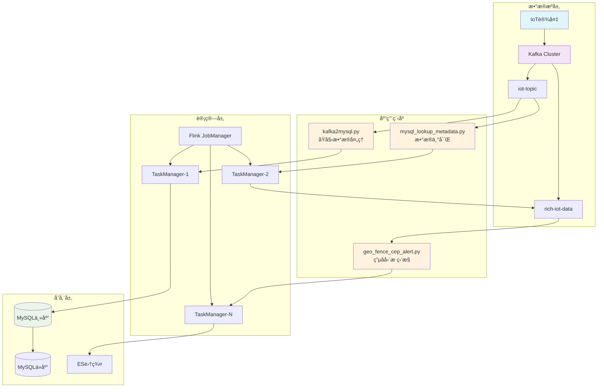
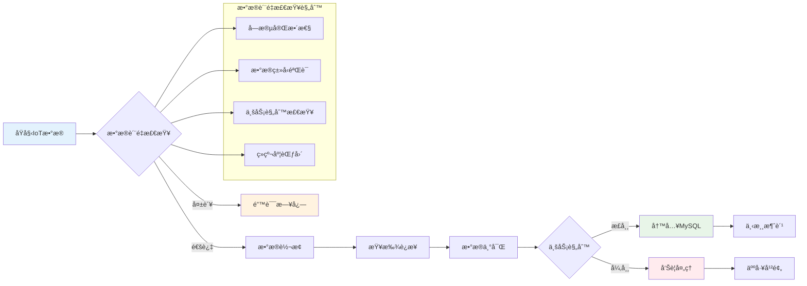

# 🚀 Flink Python å®æ—¶æ•°æ®å¤„ç†é¡¹ç›®


> 🯠**åŸºäº Apache Flink 1.19.2 å’Œ Python å®ç°çš„ä¼ä¸šçº§å®æ—¶æ•°æ®å¤„ç†ç®¡é“**

ä¸“æ³¨äº IoT 设备数æ®çš„å®æ—¶å¤„ç†ï¼Œæ”¯æŒä»æ•°æ®æ‘„å–ã€æµå¼è®¡ç®—ã€æ•°æ®ä¸°å¯Œåˆ°å­˜å‚¨è¾“出的完整链路。

## ✨ 核心特性

- 🔥 **å®æ—¶å¤„ç†**: 毫秒级数æ®å¤„ç†å»¶è¿Ÿï¼Œæ”¯æŒæµ·é‡æ•°æ®æµ
- 🯠**精确一次**: EXACTLY_ONCE 语义ä¿è¯æ•°æ®ä¸€è‡´æ€§
- 🔗 **查找è¿æ¥**: å®æ—¶å…³è”维度数æ®ï¼Œæ”¯æŒç¼“存优化
- ğŸ›¡ï¸ **容错机制**: 自动故障æ¢å¤ï¼Œæ£€æŸ¥ç‚¹æœºåˆ¶
- 📊 **æ•°æ®è´¨é‡**: 自动数æ®éªŒè¯å’Œæ¸…æ´—
- 🚀 **易äºæ‰©å±•**: 支æŒæ°´å¹³æ‰©å±•å’ŒåŠ¨æ€é…ç½®

## ğŸ—ï¸ æŠ€æœ¯æ¶æ„


```mermaid
graph TB
    subgraph "æ•°æ®æºå±‚"
        A[IoT设备] --> B[Kafka Cluster]
        B --> C[iot-topic]
        B --> D[rich-iot-data]
    end
    
    subgraph "计算层"
        E[Flink JobManager] --> F[TaskManager-1]
        E --> G[TaskManager-2]
        E --> H[TaskManager-N]
    end
    
    subgraph "存储层"
        I[(MySQL主库)]
        J[(MySQLä»åº“)]
        K[ES集群]
    end
    
    subgraph "应用程åº"
        L[kafka2mysql.py<br/>åŸå§‹æ•°æ®å¤„ç†]
        M[mysql_lookup_metadata.py<br/>æ•°æ®ä¸°å¯Œ]
        N[geo_fence_cep_alert.py<br/>电å­å›´æ ç›‘æ§]
    end
    
    C --> L
    C --> M
    D --> N
    
    L --> F
    M --> G
    N --> H
    
    F --> I
    G --> D
    H --> K
    
    I --> J
    
    style A fill:#e1f5fe
    style B fill:#f3e5f5
    style I fill:#e8f5e8
    style L fill:#fff3e0
    style M fill:#fff3e0
    style N fill:#fff3e0
```

## 🚀 快速开始

### 📋 ç¯å¢ƒè¦æ±‚

| 组件 | 版本 | è¯´æ˜ |
|------|------|------|
| Java | 8 或 11 | Flink è¿è¡Œç¯å¢ƒ |
| Python | 3.8+ | PyFlink å¼€å‘ç¯å¢ƒ |
| Apache Flink | 1.19.2 | æµå¤„ç†å¼•æ“ |
| Apache Kafka | 2.8+ | 消æ¯é˜Ÿåˆ— |
| MySQL | 8.0+ | æ•°æ®å­˜å‚¨ |

### âš¡ 一键å¯åŠ¨

```bash
# 1. 克隆项目
git clone https://github.com/your-username/flink-python.git
cd flink-python

# 2. 安装ä¾èµ–
pip install -r requirements.txt

# 3. å¯åŠ¨åŸºç¡€æœåŠ¡
docker-compose up -d kafka mysql elasticsearch

# 4. æ交核心作业
flink run -py mysql/mysql_lookup_metadata.py -pyfs . -D pipeline.name="LookupJoinJob"

# 5. 监æ§ä½œä¸šçŠ¶æ€
curl http://localhost:8081/jobs
```

## 📊 æ•°æ®å¤„ç†æµç¨‹


```mermaid
flowchart LR
    A[åŸå§‹IoTæ•°æ®] --> B{æ•°æ®è´¨é‡æ£€æŸ¥}
    B -->|通过| C[æ•°æ®è½¬æ¢]
    B -->|失败| D[错误日志]
    
    C --> E[查找è¿æ¥]
    E --> F[æ•°æ®ä¸°å¯Œ]
    
    F --> G{业务规则}
    G -->|正常| H[写入MySQL]
    G -->|异常| I[告警处ç†]
    
    H --> J[下游消费]
    I --> K[人工干预]
    
    subgraph "æ•°æ®è´¨é‡æ£€æŸ¥è§„则"
        D1[字段完整性]
        D2[æ•°æ®ç±»å‹éªŒè¯]  
        D3[业务规则检查]
        D4[ç»çº¬åº¦èŒƒå›´]
    end
    
    B --> D1
    B --> D2
    B --> D3
    B --> D4
    
    style A fill:#e3f2fd
    style H fill:#e8f5e8
    style I fill:#ffebee
    style D fill:#fff3e0
```

## 🯠核心应用

| åº”ç”¨ç¨‹åº | 功能æè¿° | 输入 | 输出 |
|----------|----------|------|------|
| `kafka2mysql.py` | IoTåŸå§‹æ•°æ®å¤„ç† | `iot-topic` | MySQL `iot_metrics` |
| `mysql_lookup_metadata.py` | **æ•°æ®ä¸°å¯Œå¤„ç†** | `iot-topic` | `rich-iot-data` |
| `geo_fence_cep_alert.py` | 电å­å›´æ å‘Šè­¦ | `rich-iot-data` | ES告警索引 |

## 📈 性能指标

| 指标 | 数值 | è¯´æ˜ |
|------|------|------|
| **ååé‡** | 100万æ¡/秒 | å•TaskManager处ç†èƒ½åŠ› |
| **延迟** | < 10ms | 端到端处ç†å»¶è¿Ÿ |
| **å¯ç”¨æ€§** | 99.9% | 包å«æ•…éšœæ¢å¤æ—¶é—´ |
| **æ•°æ®å‡†ç¡®æ€§** | 100% | EXACTLY_ONCE语义ä¿è¯ |

## 🌟 应用场景

- 🭠**IoT设备监æ§**: å®æ—¶è®¾å¤‡çŠ¶æ€ç›‘æ§å’Œå‘Šè­¦
- 👥 **用户行为分æ**: å®æ—¶ä¸ªæ€§åŒ–æ¨è系统
- 💰 **金èé£æ§**: å®æ—¶äº¤æ˜“é£é™©æ£€æµ‹
- 📦 **物æµè¿½è¸ª**: 全链路物æµçŠ¶æ€è·Ÿè¸ª

## 📠项目结æ„

```
flink-python/
├── kafka/                 # Kafka相关处ç†ç¨‹åº
│   ├── kafka2mysql.py    # åŸå§‹æ•°æ®å¤„ç†
│   └── kafka2es_*.py     # ESæ•°æ®åŒæ­¥
├── mysql/                # MySQL相关程åº
│   ├── mysql_lookup_metadata.py  # 查找è¿æ¥å®ç°
│   └── mysql_table.py   # 表æ“作工具
├── mock_data/            # æ•°æ®æ¨¡æ‹Ÿå·¥å…·
├── docs/                 # 项目文档
│   ├── åšå®¢/             # 技术åšå®¢
│   ├── 系统设计/         # æ¶æ„设计
│   └── 需求/             # 需求文档
└── geo_fence_cep_alert.py # 电å­å›´æ CEP
```

## 🤠贡献指å—

我们欢è¿æ‰€æœ‰å½¢å¼çš„贡献ï¼

### 🔧 å¼€å‘æµç¨‹

1. Fork 本项目
2. 创建特性分支 (`git checkout -b feature/amazing-feature`)
3. æ交更改 (`git commit -m 'Add some amazing feature'`)
4. æ¨é€åˆ°åˆ†æ”¯ (`git push origin feature/amazing-feature`)
5. 创建 Pull Request

### 🛠问题å馈

é‡åˆ°é—®é¢˜ï¼Ÿè¯·é€šè¿‡ä»¥ä¸‹æ–¹å¼è”系我们：

- 🛠[æ交 Issue](https://github.com/your-username/flink-python/issues)
- 💬 [å‚ä¸è®¨è®º](https://github.com/your-username/flink-python/discussions)
- 📧 å‘é€é‚®ä»¶: your-email@example.com

## 📚 学习资æº

- 📖 [详细技术åšå®¢](docs/åšå®¢/Flink_Kafka_MySQL_查找è¿æ¥å®æˆ˜.md)
- 🥠[视频教程](https://example.com/videos)
- 📠[API文档](https://example.com/docs)
- ğŸ› ï¸ [最佳å®è·µ](docs/系统设计/)

## 📄 许å¯è¯

本项目采用 [MIT 许å¯è¯](LICENSE)

## â­ Star History

[](https://star-history.com/#your-username/flink-python&Date)

---

<div align="center">

**如æœè¿™ä¸ªé¡¹ç›®å¯¹ä½ æœ‰å¸®åŠ©ï¼Œè¯·ç»™ä¸ª â­ Star 支æŒä¸€ä¸‹ï¼**

Made with â¤ï¸ by [Your Name](https://github.com/your-username)

</div> 