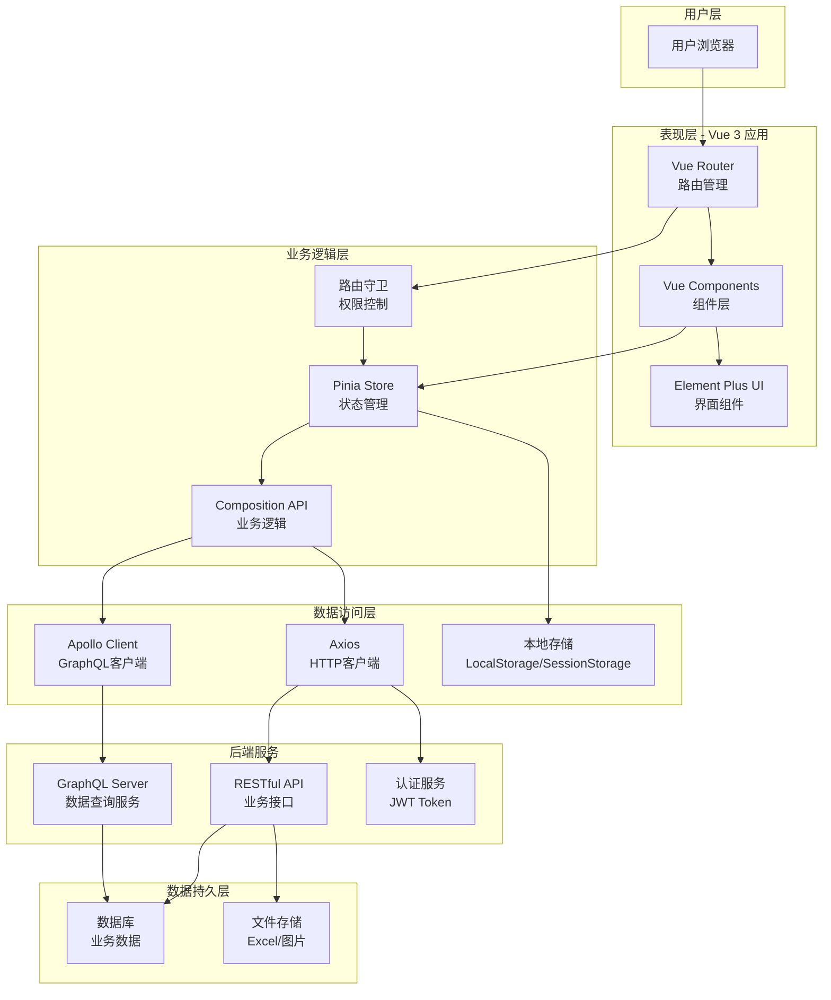
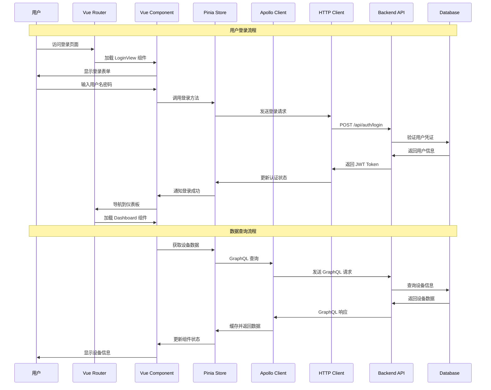
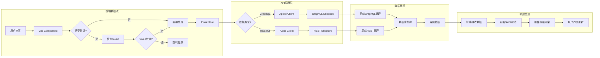
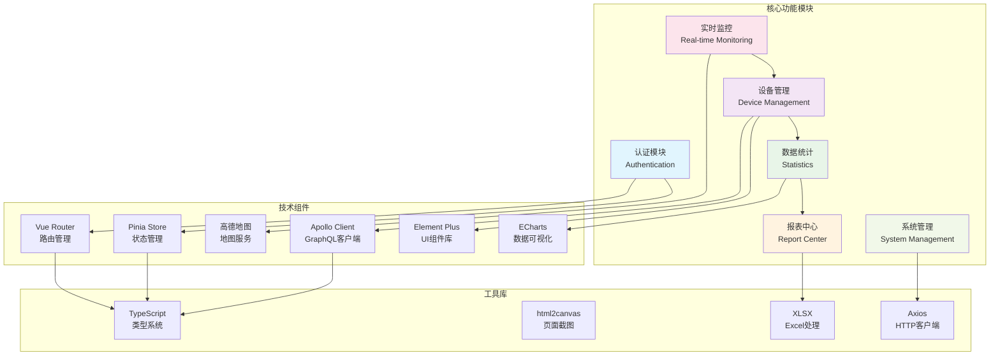

# Foundation TypeScript Vue 项目：企业级设备监控管理系统

## 目录

- [项目概述](#项目概述)
- [核心功能模块](#核心功能模块)
- [技术栈详解](#技术栈详解)
- [项目架构设计](#项目架构设计)
- [数据流转分析](#数据流转分析)
- [核心技术实现](#核心技术实现)
- [性能优化策略](#性能优化策略)
- [开发与部署](#开发与部署)
- [项目特色](#项目特色)
- [总结](#总结)

## 项目概述

本项目是一个基于 Vue 3 + TypeScript 构建的企业级设备监控管理系统，主要面向设备运营方，提供设备实时监控、数据统计分析、经营报表等核心功能。系统采用现代化的前端架构，结合 GraphQL 和 RESTful API，为用户提供直观、高效的设备管理体验。

## 核心功能模块

### 🚀 核心业务功能
- **用户认证系统**：支持登录、注册、密码重置等完整认证流程
- **设备管理**：设备详情查看、状态监控、日志记录
- **实时监控**：设备地图可视化、实时状态展示
- **数据统计**：多维度数据分析、性能统计、告警分析
- **报表中心**：经营报表、周报生成、数据导出
- **系统管理**：用户权限、系统配置等

### 📊 数据处理能力
- 支持 Excel 数据导入导出
- 实时数据可视化（ECharts）
- GraphQL 查询优化
- 本地数据缓存（Apollo Client）

## 技术栈详解

### 🏗️ 核心框架
- **Vue 3.5.13**：采用 Composition API，支持更好的 TypeScript 集成
- **TypeScript 5.8.3**：提供完整的类型安全保障
- **Vite 6.3.5**：现代化构建工具，支持热更新和快速构建

### 🎨 UI/UX 技术栈
- **Element Plus 2.9.11**：企业级 UI 组件库
- **Tailwind CSS 3.4.17**：原子化 CSS 框架，提供快速样式开发
- **ECharts 5.6.0**：数据可视化图表库

### 🔄 状态管理与路由
- **Pinia 3.0.2**：Vue 3 官方推荐的状态管理库
- **Vue Router 4.5.1**：客户端路由管理

### 🌐 数据交互
- **Apollo Client 3.13.8** + **Vue Apollo Composable 4.2.2**：GraphQL 客户端
- **Axios 1.9.0**：HTTP 请求库
- **GraphQL 16.11.0**：查询语言和运行时

### 🛠️ 工具库
- **XLSX**：Excel 文件处理
- **html2canvas**：页面截图和导出
- **高德地图 API**：地图展示功能
- **Vue i18n**：国际化支持

## 项目架构设计

### 🏗️ 系统架构图



### 📁 目录结构
```
src/
├── api/              # API 接口层
├── apollo/           # GraphQL Apollo 配置
├── assets/           # 静态资源
├── components/       # 可复用组件
│   ├── auth/         # 认证相关组件
│   ├── dashboard/    # 仪表板组件
│   ├── devices/      # 设备管理组件
│   ├── layout/       # 布局组件
│   └── report/       # 报表组件
├── graphql/          # GraphQL 查询和变更
├── router/           # 路由配置
├── stores/           # Pinia 状态管理
├── types/            # TypeScript 类型定义
├── utils/            # 工具函数
└── views/            # 页面视图
```

### 🏛️ 分层架构

项目采用经典的分层架构模式：

1. **表现层（Presentation Layer）**：Vue 组件和视图
2. **业务逻辑层（Business Logic Layer）**：Pinia Store 和组合式函数
3. **数据访问层（Data Access Layer）**：API 接口和 GraphQL 客户端
4. **数据持久层（Data Persistence Layer）**：本地存储和后端服务

## 数据流转分析

### 🔄 用户交互与数据处理流程



### 📊 数据流转图



### 🧩 功能模块关系图



## 核心技术实现

### 🔐 认证系统设计

```typescript
// stores/auth.ts - 认证状态管理
export const useAuthStore = defineStore('auth', () => {
  const token = ref<string | null>(localStorage.getItem('token'))
  const user = ref<User | null>(null)
  
  async function login(data: LoginRequest) {
    const response = await loginApi(data)
    token.value = response.token
    user.value = response.user
    
    // 支持记住登录状态
    if (data.remember) {
      localStorage.setItem('token', response.token)
    } else {
      sessionStorage.setItem('token', response.token)
    }
    return true
  }
  
  return { token, user, login, logout, getUserInfo }
})
```

### 🌐 GraphQL 集成

```typescript
// utils/apollo.ts - Apollo Client 配置
export const createApolloClient = (token: string | null) => {
  return new ApolloClient({
    link: from([
      errorLink,                    // 错误处理
      createAuthLink(token),        // 认证中间件
      httpLink,                     // HTTP 链接
    ]),
    cache: new InMemoryCache(),     // 内存缓存
    defaultOptions: {
      watchQuery: {
        fetchPolicy: 'cache-and-network', // 缓存策略
      },
    },
  })
}
```

### 🔄 路由守卫与权限控制

项目实现了完整的路由权限控制：

```typescript
// 路由元信息
meta: {
  title: '设备详情',
  requiresAuth: true,     // 需要认证
  roles: ['admin'],       // 角色权限（可选）
}
```

### 📊 数据可视化

集成 ECharts 实现丰富的数据可视化：
- 设备状态监控仪表盘
- 性能趋势分析图表
- 地理位置分布图
- 实时数据统计图表

### 📋 Excel 数据处理

支持完整的 Excel 数据导入导出流程：
- 模板下载和数据验证
- 批量数据导入处理
- 报表数据导出
- 样式化 Excel 生成

## 性能优化策略

### 🚀 性能优化架构图

```mermaid
graph TD
    subgraph "性能优化策略"
        A[构建优化<br/>Build Optimization]
        B[缓存策略<br/>Caching Strategy]
        C[异步处理<br/>Async Processing]
        D[资源优化<br/>Resource Optimization]
    end
    
    subgraph "构建优化"
        A1[Vite 构建<br/>Modern Build Tool]
        A2[代码分割<br/>Code Splitting]
        A3[Tree Shaking<br/>Dead Code Elimination]
        A4[Bundle 分析<br/>Bundle Analysis]
    end
    
    subgraph "缓存机制"
        B1[Apollo 缓存<br/>GraphQL Cache]
        B2[HTTP 缓存<br/>Request Cache]
        B3[本地存储<br/>Local Storage]
        B4[浏览器缓存<br/>Browser Cache]
    end
    
    subgraph "异步优化"
        C1[路由懒加载<br/>Lazy Loading]
        C2[组件懒加载<br/>Component Lazy Load]
        C3[数据预取<br/>Data Prefetch]
        C4[防抖节流<br/>Debounce/Throttle]
    end
    
    subgraph "资源优化"
        D1[图片压缩<br/>Image Compression]
        D2[CDN 加速<br/>CDN Acceleration]
        D3[Gzip 压缩<br/>Gzip Compression]
        D4[静态资源优化<br/>Static Assets]
    end
    
    A --> A1
    A --> A2
    A --> A3
    A --> A4
    
    B --> B1
    B --> B2
    B --> B3
    B --> B4
    
    C --> C1
    C --> C2
    C --> C3
    C --> C4
    
    D --> D1
    D --> D2
    D --> D3
    D --> D4
    
    style A fill:#e3f2fd
    style B fill:#f1f8e9
    style C fill:#fff3e0
    style D fill:#fce4ec
```



### ⚡ 构建优化
- **Vite 构建**：利用原生 ES 模块提升开发体验
- **代码分割**：路由级别的懒加载
- **Tree Shaking**：移除未使用的代码
- **资源压缩**：图片和静态资源优化

### 🗃️ 缓存策略
- **Apollo Client 缓存**：GraphQL 查询结果缓存
- **HTTP 缓存**：API 响应缓存
- **本地存储**：用户偏好和临时数据缓存

### 🔄 异步处理
- **组件懒加载**：按需加载页面组件
- **数据预加载**：关键数据提前获取
- **防抖节流**：用户交互优化

## 开发与部署

### 🛠️ 开发环境
```bash
# 安装依赖
npm install

# 启动开发服务器
npm run dev

# 类型检查
npm run build
```

### 🚀 生产部署
- 支持 Docker 容器化部署
- 可集成到 Go 二进制文件中
- 支持 Nginx 静态资源服务
- CDN 加速优化

## 项目特色

### ✨ 现代化开发体验
- **TypeScript 全覆盖**：完整的类型安全
- **Composition API**：更好的逻辑复用
- **ES6+ 语法**：现代 JavaScript 特性
- **热模块替换**：快速开发迭代

### 🔧 可维护性设计
- **模块化架构**：清晰的代码组织
- **组件化开发**：可复用的 UI 组件
- **类型定义完善**：减少运行时错误
- **代码规范统一**：ESLint + Prettier

### 📈 扩展性考虑
- **插件化架构**：支持功能模块扩展
- **配置化开发**：灵活的系统配置
- **国际化支持**：多语言适配能力
- **主题定制**：可配置的 UI 主题

## 总结

本项目展示了现代 Vue.js 应用的最佳实践，通过合理的架构设计和技术选型，构建了一个功能完善、性能优异的企业级应用。项目不仅满足了业务需求，还为未来的扩展和维护奠定了良好的基础。

关键技术亮点：
- 🎯 **完整的 TypeScript 生态**
- 🚀 **现代化的构建工具链**
- 🔄 **GraphQL + RESTful 双重数据方案**
- 📊 **丰富的数据可视化能力**
- 🛡️ **完善的权限控制系统**
- ⚡ **优秀的性能表现**

这个项目为企业级 Vue.js 应用开发提供了一个优秀的参考模板，体现了前端工程化的发展趋势和最佳实践。 