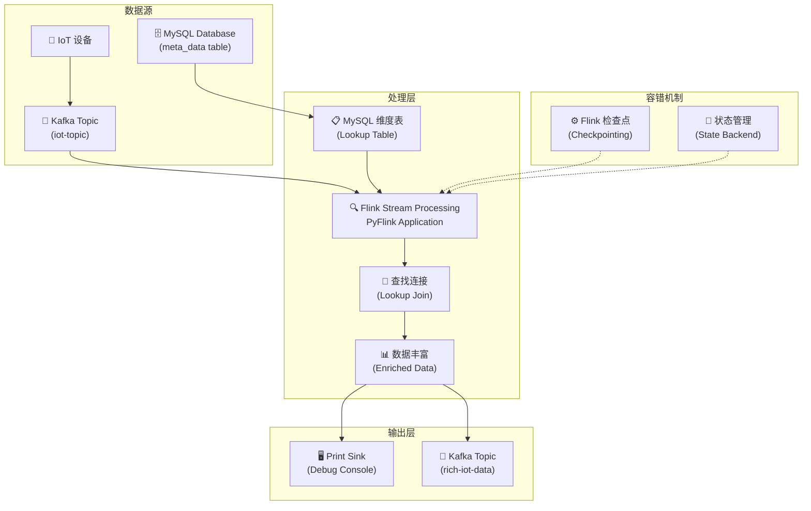
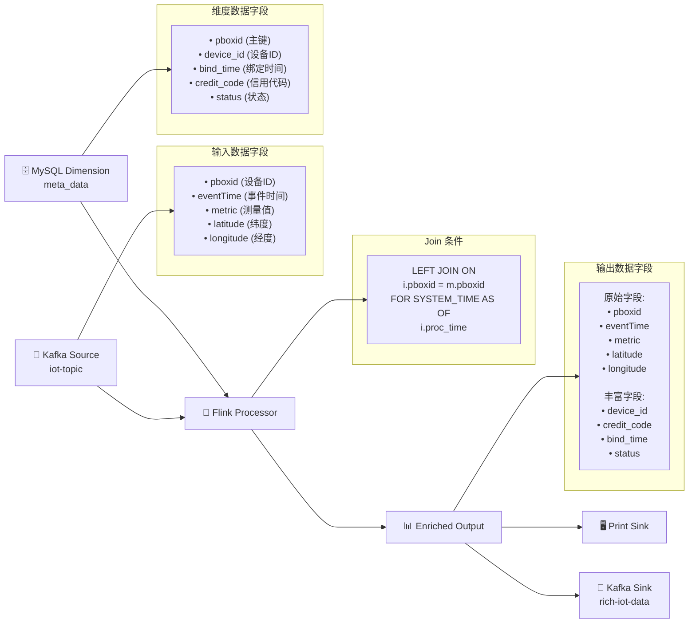
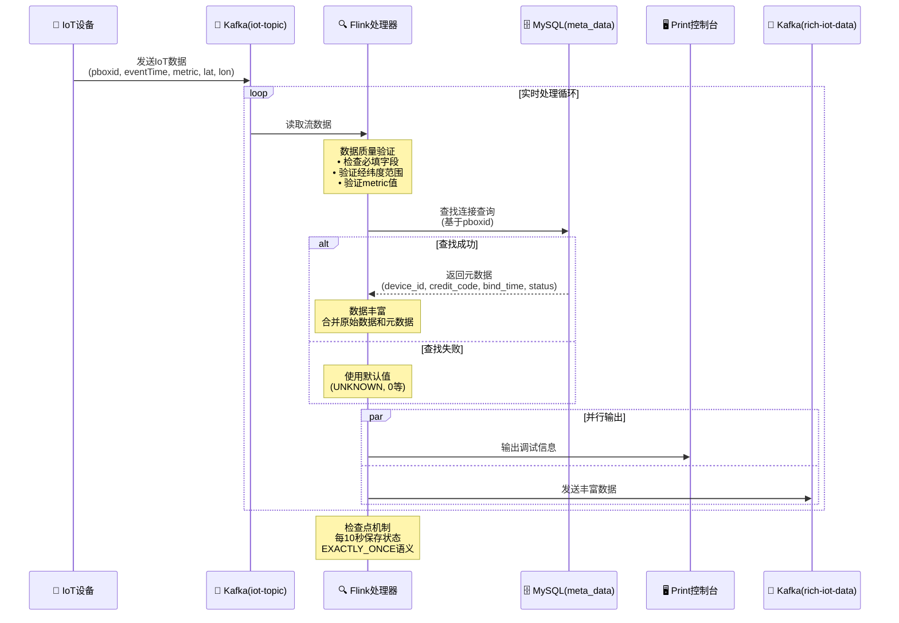
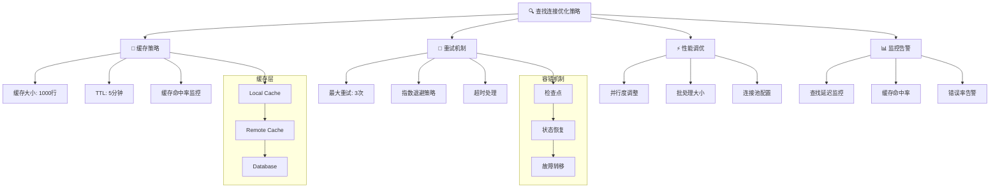

## 📋 目录

- [📋 目录](#-目录)
- [📖 概述](#-概述)
  - [🎯 本文特点](#-本文特点)
- [🏗️ 技术架构](#️-技术架构)
  - [🧩 核心组件](#-核心组件)
  - [🔄 数据流转过程](#-数据流转过程)
  - [系统架构图](#系统架构图)
- [⚙️ 实现细节](#️-实现细节)
  - [1️⃣ 环境配置](#1️⃣-环境配置)
  - [2️⃣ 数据源定义](#2️⃣-数据源定义)
    - [📡 Kafka 源表](#-kafka-源表)
    - [🗄️ MySQL 维度表](#️-mysql-维度表)
  - [3️⃣ 查找连接实现](#3️⃣-查找连接实现)
  - [数据字段流转图](#数据字段流转图)
  - [处理流程时序图](#处理流程时序图)
- [🚀 性能优化策略](#-性能优化策略)
  - [优化策略总览](#优化策略总览)
  - [1️⃣ 查找连接缓存](#1️⃣-查找连接缓存)
  - [2️⃣ 检查点配置](#2️⃣-检查点配置)
  - [3️⃣ 并行度设置](#3️⃣-并行度设置)
- [📊 监控与调试](#-监控与调试)
  - [1️⃣ Print Sink 调试](#1️⃣-print-sink-调试)
  - [2️⃣ 数据质量监控](#2️⃣-数据质量监控)
- [🚀 部署方式](#-部署方式)
  - [1️⃣ 集群部署](#1️⃣-集群部署)
  - [2️⃣ 本地调试](#2️⃣-本地调试)
- [🎯 最佳实践](#-最佳实践)
  - [1️⃣ 数据质量保证](#1️⃣-数据质量保证)
  - [2️⃣ 容错设计](#2️⃣-容错设计)
  - [3️⃣ 性能调优](#3️⃣-性能调优)
- [🌟 应用场景](#-应用场景)
- [🎉 总结](#-总结)
  - [🏆 关键收益](#-关键收益)
  - [🚀 适用性](#-适用性)

---

## 📖 概述

在实时数据处理场景中，我们经常需要将流式数据与维度数据进行关联，以丰富原始数据。本文将详细介绍如何使用 PyFlink 实现 Kafka + MySQL 的查找连接（Lookup Join），从而实现 IoT 设备数据的实时元数据丰富。

### 🎯 本文特点

- **实战导向**：基于真实的生产环境代码
- **图文并茂**：包含完整的 Mermaid 可视化图表
- **最佳实践**：涵盖性能优化、监控调试、容错设计
- **端到端**：从数据源到输出的完整方案

## 🏗️ 技术架构

### 🧩 核心组件

| 组件 | 描述 | 作用 |
|------|------|------|
| 📡 **Kafka Source** | `iot-topic` | 存储原始 IoT 设备数据 |
| 🗄️ **MySQL 维度表** | `meta_data` | 存储设备元数据信息 |
| 🔍 **Apache Flink** | PyFlink | 实现实时流处理和查找连接 |
| 🖥️ **Print Sink** | 调试输出 | 用于调试和监控 |
| 📡 **Kafka Sink** | `rich-iot-data` | 存储丰富后的数据 |

### 🔄 数据流转过程

| 步骤 | 操作 | 描述 |
|------|------|------|
| 1️⃣ | **数据摄取** | 从 Kafka `iot-topic` 读取原始 IoT 数据 |
| 2️⃣ | **查找连接** | 基于 `pboxid` 字段查找 MySQL 中的设备元数据 |
| 3️⃣ | **数据丰富** | 将原始数据与元数据合并 |
| 4️⃣ | **数据输出** | 同时输出到控制台和 Kafka `rich-iot-data` topic |

### 系统架构图

上述流程的整体架构如下图所示，展示了从数据源到输出的完整链路：



---

## ⚙️ 实现细节

### 1️⃣ 环境配置

```python
def _create_table_environment_with_checkpointing():
    """创建 Table 环境并配置检查点"""
    env = StreamExecutionEnvironment.get_execution_environment()
    env.set_parallelism(1)
    
    # 配置检查点，确保 Exactly-Once 语义
    env.enable_checkpointing(10000)  # 每10秒触发一次检查点
    env.get_checkpoint_config().set_checkpointing_mode(CheckpointingMode.EXACTLY_ONCE)
    
    # 创建流式 Table 环境
    settings = EnvironmentSettings.new_instance().in_streaming_mode().build()
    table_env = TableEnvironment.create(settings)
    
    return table_env
```

**关键配置说明**:
- **检查点间隔**: 10秒，确保容错性
- **语义保证**: EXACTLY_ONCE，确保数据一致性
- **时区设置**: Asia/Shanghai，处理时间本地化
- **状态保留**: 1天，平衡性能与资源

### 2️⃣ 数据源定义

#### 📡 Kafka 源表
```sql
CREATE TABLE iot_source_fixed (
    `pboxid` STRING COMMENT '设备唯一标识',
    `eventTime` STRING COMMENT '事件时间字符串',
    `metric` DECIMAL(10,2) COMMENT '测量值',
    `latitude` DECIMAL(10,7) COMMENT '纬度',
    `longitude` DECIMAL(10,7) COMMENT '经度',
    `proc_time` AS PROCTIME() COMMENT '处理时间'
) WITH (
    'connector' = 'kafka',
    'topic' = 'iot-topic',
    'properties.bootstrap.servers' = 'localhost:9092',
    'properties.group.id' = 'lookup-test-group-fixed',
    'scan.startup.mode' = 'group-offsets',
    'properties.auto.offset.reset' = 'latest',
    'format' = 'json'
)
```

#### 🗄️ MySQL 维度表
```sql
CREATE TABLE meta_data_dim_fixed (
    `pboxid` STRING PRIMARY KEY NOT ENFORCED COMMENT '设备唯一标识',
    `device_id` STRING COMMENT '设备ID',
    `bind_time` TIMESTAMP(3) COMMENT '绑定时间',
    `unbind_time` TIMESTAMP(3) COMMENT '解绑时间',
    `credit_code` STRING COMMENT '信用代码',
    `status` INT COMMENT '状态：1-正常，0-禁用'
) WITH (
    'connector' = 'jdbc',
    'url' = 'jdbc:mysql://localhost:3306/testdb',
    'table-name' = 'meta_data',
    'lookup.cache.max-rows' = '1000',
    'lookup.cache.ttl' = '5min',
    'lookup.max-retries' = '3'
)
```

**查找连接优化配置**:
- **缓存行数**: 1000行，减少数据库查询
- **缓存TTL**: 5分钟，平衡数据新鲜度与性能
- **重试次数**: 3次，提高容错性

### 3️⃣ 查找连接实现

```sql
CREATE TEMPORARY VIEW enriched_iot_data AS
SELECT 
    i.pboxid,
    i.eventTime,
    i.metric,
    i.latitude,
    i.longitude,
    COALESCE(m.device_id, 'UNKNOWN') as device_id,
    COALESCE(m.credit_code, 'UNKNOWN') as credit_code,
    COALESCE(CAST(m.bind_time AS STRING), '') as bind_time,
    COALESCE(m.status, 0) as status
FROM iot_source_fixed i
LEFT JOIN meta_data_dim_fixed FOR SYSTEM_TIME AS OF i.proc_time AS m
ON i.pboxid = m.pboxid
WHERE i.pboxid IS NOT NULL 
  AND i.latitude BETWEEN -90 AND 90
  AND i.longitude BETWEEN -180 AND 180
  AND i.metric >= 0
```

**关键特性**:
- **时间语义**: `FOR SYSTEM_TIME AS OF` 确保查找连接的时间一致性
- **空值处理**: 使用 `COALESCE` 提供默认值
- **数据质量**: 验证经纬度范围和测量值有效性

### 数据字段流转图

下图详细展示了数据从输入到输出的字段映射关系：



### 处理流程时序图

下图展示了实时处理的详细时序步骤：



---

## 🚀 性能优化策略

### 优化策略总览

下图展示了查找连接的完整优化策略，包括缓存、重试、性能调优和监控等多个维度：



### 1️⃣ 查找连接缓存

| 配置项 | 值 | 说明 |
|--------|----|----|
| `lookup.cache.max-rows` | `1000` | 缓存最大行数 |
| `lookup.cache.ttl` | `5min` | 缓存生存时间 |
| `lookup.max-retries` | `3` | 最大重试次数 |

```properties
lookup.cache.max-rows = 1000        # 缓存最大行数
lookup.cache.ttl = 5min            # 缓存生存时间
lookup.max-retries = 3             # 最大重试次数
```

### 2️⃣ 检查点配置

| 配置项 | 值 | 说明 |
|--------|----|----|
| `execution.checkpointing.interval` | `10s` | 检查点间隔 |
| `execution.checkpointing.mode` | `EXACTLY_ONCE` | 一致性保证 |
| `execution.checkpointing.timeout` | `60s` | 检查点超时 |

```properties
execution.checkpointing.interval = 10s      # 检查点间隔
execution.checkpointing.mode = EXACTLY_ONCE # 一致性保证
execution.checkpointing.timeout = 60s       # 检查点超时
```

### 3️⃣ 并行度设置

```python
env.set_parallelism(1)  # 根据实际负载调整
```

> 💡 **提示**: 并行度设置需要根据数据量、机器资源和延迟要求进行调整

---

## 📊 监控与调试

### 1️⃣ Print Sink 调试
```sql
CREATE TABLE lookup_result_print (
    -- 字段定义
) WITH (
    'connector' = 'print',
    'print-identifier' = 'Kafka-MySQL-Lookup'
)
```

### 2️⃣ 数据质量监控

| 监控项 | 验证规则 | 目的 |
|--------|----------|------|
| 📍 **经纬度范围** | latitude: [-90, 90]<br/>longitude: [-180, 180] | 地理位置有效性 |
| 📏 **测量值** | metric >= 0 | 业务逻辑有效性 |
| 🎯 **查找连接命中率** | 监控缓存命中率 | 性能优化指标 |

---

## 🚀 部署方式

### 1️⃣ 集群部署
```bash
flink run -py mysql/mysql_lookup_metadata.py -pyfs . -D pipeline.name="MysqlLookupMetadataJob"
```

### 2️⃣ 本地调试
```bash
python mysql/mysql_lookup_metadata.py
```

> ⚠️ **注意**: 本地运行需要添加 `result.wait()` 保持任务持续运行。

---

## 🎯 最佳实践

### 1️⃣ 数据质量保证

| 实践项 | 具体措施 | 预期效果 |
|--------|----------|----------|
| 🔍 **输入数据验证** | 字段完整性、数据类型检查 | 提高数据准确性 |
| 💾 **缓存策略** | 合理设置缓存大小和TTL | 平衡性能与新鲜度 |
| 📈 **性能监控** | 监控查找连接命中率和延迟 | 及时发现性能问题 |

### 2️⃣ 容错设计

| 容错机制 | 配置要点 | 容错效果 |
|----------|----------|----------|
| ⚡ **检查点机制** | 10秒间隔，EXACTLY_ONCE模式 | 故障自动恢复 |
| 🔄 **重试策略** | 最大3次重试，指数退避 | 处理临时网络问题 |
| 🛡️ **降级处理** | 维度表不可用时使用默认值 | 保证服务可用性 |

### 3️⃣ 性能调优

| 调优维度 | 优化策略 | 性能提升 |
|----------|----------|----------|
| 🚀 **并行度** | 根据数据量和资源动态调整 | 提高处理吞吐量 |
| 📦 **批处理** | 优化批大小和缓存配置 | 减少网络开销 |
| 📊 **监控告警** | 设置背压和延迟阈值 | 及时性能调优 |

---

## 🌟 应用场景

| 场景 | 应用描述 | 技术优势 |
|------|----------|----------|
| 🏭 **IoT 设备监控** | 实时丰富设备位置和状态信息 | 毫秒级响应，支持海量设备 |
| 👥 **用户行为分析** | 关联用户基础信息和行为数据 | 实时个性化推荐 |
| 💰 **金融风控** | 实时关联交易和客户信息 | 秒级风险识别 |
| 📦 **物流追踪** | 丰富包裹和运输信息 | 全链路实时可视化 |

---

## 🎉 总结

本文展示了如何使用 PyFlink 实现 Kafka + MySQL 的查找连接，实现了实时数据丰富的完整方案。通过合理的配置和优化，能够在保证数据一致性的同时，实现高性能的实时数据处理。

### 🏆 关键收益

| 收益维度 | 具体表现 | 业务价值 |
|----------|----------|----------|
| ⚡ **实时性** | 毫秒级数据处理延迟 | 支持实时决策 |
| 🎯 **一致性** | EXACTLY_ONCE 语义保证 | 数据准确可靠 |
| 📈 **可扩展性** | 支持水平扩展 | 适应业务增长 |
| 🛡️ **容错性** | 自动故障恢复机制 | 提高服务稳定性 |

### 🚀 适用性

这种架构为实时数据丰富提供了**可靠、高效**的解决方案，特别适用于：

- 📊 **数据量大**：支持每秒百万级数据处理
- ⏱️ **延迟敏感**：毫秒级端到端延迟
- 🔄 **变化频繁**：支持动态配置和扩缩容
- 🎯 **质量要求高**：EXACTLY_ONCE语义保证

---

> 💡 **下一步**: 可以基于此架构扩展更多数据源和 Sink，构建完整的实时数据湖解决方案。 