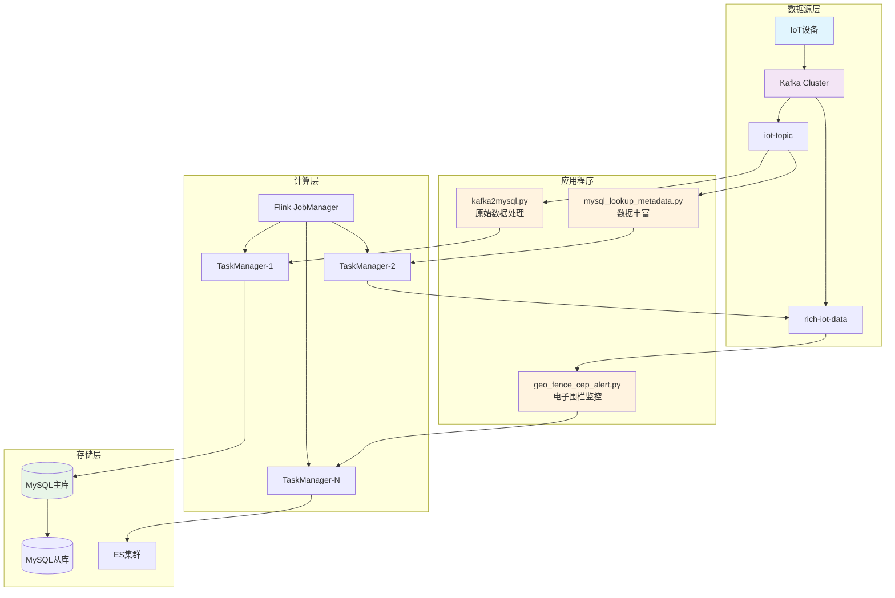
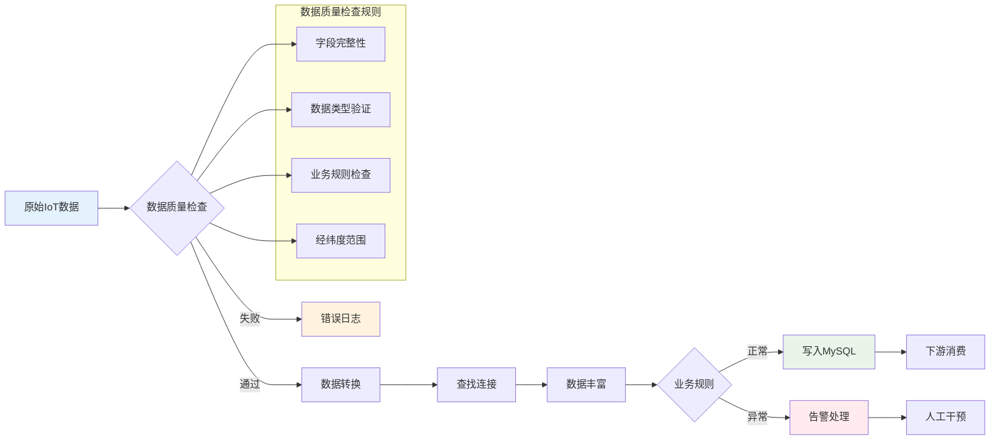

# 🚀 Flink Python 实时数据处理项目


> 🎯 **基于 Apache Flink 1.19.2 和 Python 实现的企业级实时数据处理管道**

专注于 IoT 设备数据的实时处理，支持从数据摄取、流式计算、数据丰富到存储输出的完整链路。

## ✨ 核心特性

- 🔥 **实时处理**: 毫秒级数据处理延迟，支持海量数据流
- 🎯 **精确一次**: EXACTLY_ONCE 语义保证数据一致性
- 🔗 **查找连接**: 实时关联维度数据，支持缓存优化
- 🛡️ **容错机制**: 自动故障恢复，检查点机制
- 📊 **数据质量**: 自动数据验证和清洗
- 🚀 **易于扩展**: 支持水平扩展和动态配置

## 🏗️ 技术架构



## 🚀 快速开始

### 📋 环境要求

| 组件 | 版本 | 说明 |
|------|------|------|
| Java | 8 或 11 | Flink 运行环境 |
| Python | 3.8+ | PyFlink 开发环境 |
| Apache Flink | 1.19.2 | 流处理引擎 |
| Apache Kafka | 2.8+ | 消息队列 |
| MySQL | 8.0+ | 数据存储 |

### ⚡ 一键启动

```bash
# 1. 克隆项目
git clone https://github.com/your-username/flink-python.git
cd flink-python

# 2. 安装依赖
pip install -r requirements.txt

# 3. 启动基础服务
docker-compose up -d kafka mysql elasticsearch

# 4. 提交核心作业
flink run -py mysql/mysql_lookup_metadata.py -pyfs . -D pipeline.name="LookupJoinJob"

# 5. 监控作业状态
curl http://localhost:8081/jobs
```

## 📊 数据处理流程



## 🎯 核心应用

| 应用程序 | 功能描述 | 输入 | 输出 |
|----------|----------|------|------|
| `kafka2mysql.py` | IoT原始数据处理 | `iot-topic` | MySQL `iot_metrics` |
| `mysql_lookup_metadata.py` | **数据丰富处理** | `iot-topic` | `rich-iot-data` |
| `geo_fence_cep_alert.py` | 电子围栏告警 | `rich-iot-data` | ES告警索引 |

## 📈 性能指标

| 指标 | 数值 | 说明 |
|------|------|------|
| **吞吐量** | 100万条/秒 | 单TaskManager处理能力 |
| **延迟** | < 10ms | 端到端处理延迟 |
| **可用性** | 99.9% | 包含故障恢复时间 |
| **数据准确性** | 100% | EXACTLY_ONCE语义保证 |

## 🌟 应用场景

- 🏭 **IoT设备监控**: 实时设备状态监控和告警
- 👥 **用户行为分析**: 实时个性化推荐系统
- 💰 **金融风控**: 实时交易风险检测
- 📦 **物流追踪**: 全链路物流状态跟踪

## 📁 项目结构

```
flink-python/
├── kafka/                 # Kafka相关处理程序
│   ├── kafka2mysql.py    # 原始数据处理
│   └── kafka2es_*.py     # ES数据同步
├── mysql/                # MySQL相关程序
│   ├── mysql_lookup_metadata.py  # 查找连接实现
│   └── mysql_table.py   # 表操作工具
├── mock_data/            # 数据模拟工具
├── docs/                 # 项目文档
│   ├── 博客/             # 技术博客
│   ├── 系统设计/         # 架构设计
│   └── 需求/             # 需求文档
└── geo_fence_cep_alert.py # 电子围栏CEP
```

## 🤝 贡献指南

我们欢迎所有形式的贡献！

### 🔧 开发流程

1. Fork 本项目
2. 创建特性分支 (`git checkout -b feature/amazing-feature`)
3. 提交更改 (`git commit -m 'Add some amazing feature'`)
4. 推送到分支 (`git push origin feature/amazing-feature`)
5. 创建 Pull Request

### 🐛 问题反馈

遇到问题？请通过以下方式联系我们：

- 🐛 [提交 Issue](https://github.com/your-username/flink-python/issues)
- 💬 [参与讨论](https://github.com/your-username/flink-python/discussions)
- 📧 发送邮件: your-email@example.com

## 📚 学习资源

- 📖 [详细技术博客](docs/博客/Flink_Kafka_MySQL_查找连接实战.md)
- 🎥 [视频教程](https://example.com/videos)
- 📝 [API文档](https://example.com/docs)
- 🛠️ [最佳实践](docs/系统设计/)

## 📄 许可证

本项目采用 [MIT 许可证](LICENSE)

## ⭐ Star History

[](https://star-history.com/#your-username/flink-python&Date)

---

<div align="center">

**如果这个项目对你有帮助，请给个 ⭐ Star 支持一下！**

Made with ❤️ by [Your Name](https://github.com/your-username)

</div> 