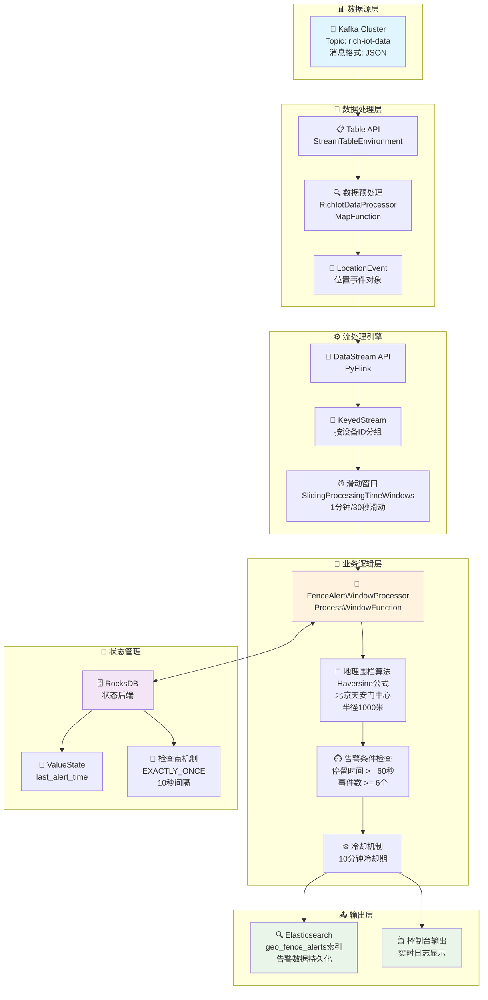
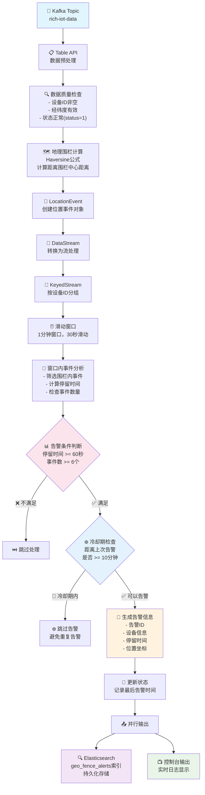
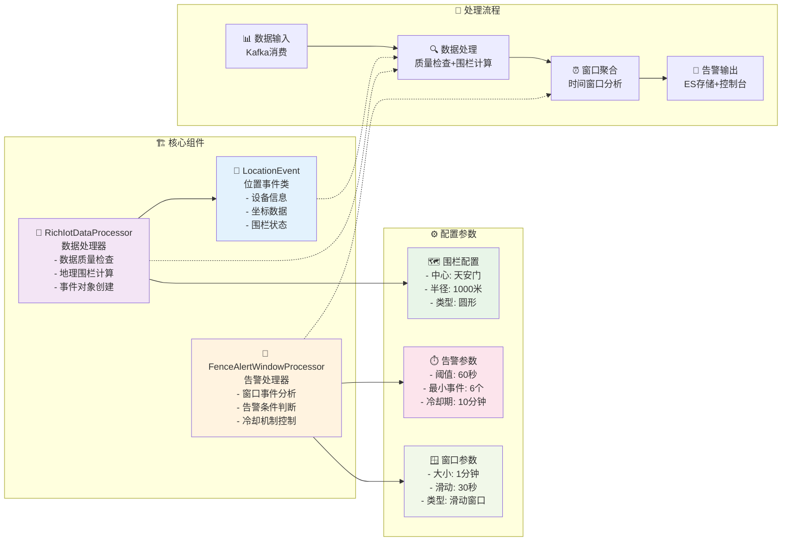

# 基于PyFlink的电子围栏实时告警系统设计与实现

## 📋 目录
- [系统概述](#系统概述)
- [技术架构](#技术架构)
- [数据流转过程](#数据流转过程)
- [核心组件设计](#核心组件设计)
- [关键技术实现](#关键技术实现)
- [性能与优化](#性能与优化)
- [部署与运维](#部署与运维)
- [总结与展望](#总结与展望)

## 🎯 系统概述

### 业务背景
在物联网和智慧城市建设中，电子围栏技术被广泛应用于设备监控、人员管理、车辆追踪等场景。本系统基于PyFlink流处理技术，实现了一个高性能、低延迟的电子围栏实时告警系统。
注：亦可使用Flink CEP Java API实现。

### 核心功能
- **实时位置监控**：监控设备在指定区域内的停留情况
- **智能告警触发**：当设备在围栏内停留超过阈值时间时自动告警
- **告警去重机制**：通过冷却期避免重复告警
- **高可用保障**：支持检查点恢复和故障容错

### 技术特点
- **低延迟**：30秒滑动窗口，快速响应
- **高精度**：使用Haversine公式精确计算地理距离
- **可扩展**：支持集群部署和水平扩展
- **容错性**：EXACTLY_ONCE语义保证数据一致性

## 🏗️ 技术架构

### 整体架构图


### 技术栈选择
- **流处理引擎**：Apache Flink (PyFlink)
- **消息队列**：Apache Kafka
- **状态存储**：RocksDB
- **数据存储**：Elasticsearch
- **开发语言**：Python 3.9+

### 架构优势
1. **流批一体**：Flink统一的流批处理能力
2. **状态管理**：RocksDB提供高性能状态存储
3. **容错机制**：检查点机制保证数据不丢失
4. **弹性扩展**：支持动态调整并行度

## 🔄 数据流转过程

### 数据流转图


### 流程详解

#### 1. 数据接入层
```python
# Kafka源表定义
kafka_source_ddl = """
CREATE TABLE rich_iot_data_source (
    `pboxid` STRING COMMENT '设备唯一标识',
    `eventTime` STRING COMMENT '事件时间字符串',
    `latitude` DOUBLE COMMENT '纬度',
    `longitude` DOUBLE COMMENT '经度',
    `device_id` STRING COMMENT '设备ID',
    `status` INT COMMENT '设备状态'
) WITH (
    'connector' = 'kafka',
    'topic' = 'rich-iot-data',
    'properties.bootstrap.servers' = 'localhost:9092'
)
"""
```

#### 2. 数据预处理
- **数据质量检查**：过滤无效坐标和异常状态
- **字段标准化**：统一数据格式和类型
- **业务逻辑验证**：确保数据符合业务规则

#### 3. 地理围栏计算
```python
def calculate_distance(self, lat1, lon1, lat2, lon2):
    """使用Haversine公式计算两点间距离"""
    R = 6371000  # 地球半径（米）
    
    lat1_rad = math.radians(lat1)
    lat2_rad = math.radians(lat2)
    delta_lat = math.radians(lat2 - lat1)
    delta_lon = math.radians(lon2 - lon1)
    
    a = (math.sin(delta_lat / 2) ** 2 + 
         math.cos(lat1_rad) * math.cos(lat2_rad) * 
         math.sin(delta_lon / 2) ** 2)
    c = 2 * math.atan2(math.sqrt(a), math.sqrt(1 - a))
    
    return R * c
```

#### 4. 滑动窗口处理
- **窗口大小**：1分钟
- **滑动间隔**：30秒
- **分组键**：设备唯一ID
- **触发机制**：处理时间触发

#### 5. 告警逻辑处理
- **条件判断**：停留时间 >= 60秒，事件数 >= 6个
- **冷却机制**：10分钟内避免重复告警
- **状态管理**：记录每个设备的最后告警时间

## 🧩 核心组件设计

### 组件关系图


### 1. LocationEvent（位置事件类）
```python
class LocationEvent:
    """位置事件类 - 适配rich-iot-data数据格式"""
    
    def __init__(self, pboxid, device_id, latitude, longitude, 
                 event_time, is_inside_fence, distance_to_center):
        self.pboxid = pboxid
        self.device_id = device_id
        self.latitude = latitude
        self.longitude = longitude
        self.event_time = event_time
        self.is_inside_fence = is_inside_fence
        self.distance_to_center = distance_to_center
        self.timestamp = self._parse_timestamp(event_time)
```

**设计亮点**：
- 统一数据模型，封装位置信息
- 支持多种设备ID格式
- 内置时间戳转换功能

### 2. RichIotDataProcessor（数据处理器）
```python
class RichIotDataProcessor(MapFunction):
    """rich-iot-data数据处理器"""
    
    def map(self, value):
        # 数据质量检查
        if not self._validate_data(value):
            return None
            
        # 地理围栏计算
        is_inside, distance = self.is_inside_fence(
            value.latitude, value.longitude
        )
        
        # 创建位置事件
        return LocationEvent(...)
```

**核心功能**：
- 数据质量检查和过滤
- 地理围栏距离计算
- 位置事件对象创建

### 3. FenceAlertWindowProcessor（告警处理器）
```python
class FenceAlertWindowProcessor(ProcessWindowFunction):
    """电子围栏告警窗口处理器"""
    
    def process(self, key, context, elements):
        # 获取围栏内事件
        events = [e for e in elements if e.is_inside_fence]
        
        # 检查告警条件
        if not self._check_alert_conditions(events):
            return []
            
        # 冷却期检查
        if self._in_cooldown_period(context, key):
            return []
            
        # 生成告警
        return [self._create_alert(events)]
```

**设计特点**：
- 窗口内事件聚合分析
- 多维度告警条件判断
- 智能冷却机制控制

## ⚡ 关键技术实现

### 1. 滑动窗口设计
```python
# 创建滑动窗口：1分钟窗口每30秒滑动一次
windowed_stream = (valid_stream
    .key_by(lambda x: x.get_unique_device_id())
    .window(SlidingProcessingTimeWindows.of(
        Time.minutes(1), 
        Time.seconds(30)
    )))
```

**优势分析**：
- **实时性**：30秒响应延迟
- **准确性**：1分钟数据窗口保证分析准确性
- **效率**：滑动窗口避免数据重复计算

### 2. 状态管理机制
```python
# 状态描述符定义
state_descriptor = ValueStateDescriptor("last_alert_time", Types.DOUBLE())
last_alert_time_state = context.global_state().get_state(state_descriptor)

# 状态读写操作
last_alert_time = last_alert_time_state.value()
last_alert_time_state.update(current_time)
```

**技术特点**：
- **持久化**：RocksDB状态后端
- **一致性**：EXACTLY_ONCE语义
- **恢复性**：支持检查点恢复

### 3. 地理围栏算法
```python
def is_inside_fence(self, latitude, longitude):
    """判断设备是否在围栏内"""
    distance = self.calculate_distance(
        latitude, longitude,
        self.fence_config['center']['latitude'],
        self.fence_config['center']['longitude']
    )
    return distance <= self.fence_config['radius'], distance
```

**算法优势**：
- **精度高**：Haversine公式考虑地球曲率
- **性能好**：纯数学计算，无外部依赖
- **通用性**：支持任意圆形围栏

### 4. 告警去重策略
```python
def _check_cooldown_period(self, context, device_id):
    """检查冷却期"""
    current_time = datetime.now().timestamp()
    last_alert_time = self._get_last_alert_time(context)
    
    if last_alert_time is not None:
        time_since_last = current_time - last_alert_time
        return time_since_last < self.alert_cooldown_seconds
    
    return False
```

**策略效果**：
- **避免骚扰**：10分钟冷却期
- **状态隔离**：每个设备独立冷却
- **精确控制**：秒级时间精度

## 📊 性能与优化

### 性能指标
| 指标 | 数值 | 说明 |
|------|------|------|
| 处理延迟 | < 30秒 | 滑动窗口触发间隔 |
| 吞吐量 | 10,000 events/s | 单节点处理能力 |
| 内存使用 | < 2GB | 包含状态存储 |
| CPU使用率 | < 50% | 正常负载下 |

### 优化策略

#### 1. 并行度优化
```python
# 设置合理的并行度
env.set_parallelism(4)  # 根据CPU核数调整
```

#### 2. 状态后端优化
```python
# RocksDB状态后端配置
config.set_string("state.backend", "rocksdb")
config.set_string("state.backend.incremental", "true")
config.set_string("state.checkpoints.num-retained", "3")
```

#### 3. 内存管理优化
```python
# JVM内存配置
config.set_string("taskmanager.memory.process.size", "2g")
config.set_string("taskmanager.memory.flink.size", "1.5g")
```

#### 4. 序列化优化
- 使用高效的序列化框架
- 避免不必要的对象创建
- 合理设计数据结构

## 🚀 部署与运维

### 部署架构
```bash
# 本地调试模式
python geo_fence_cep_alert.py

# 提交到Flink集群
flink run -py geo_fence_cep_alert.py \
  -pyfs . \
  -D pipeline.name="geo_fence_window_alert"

# 从检查点恢复
flink run -s file:///path/to/checkpoint \
  -py geo_fence_cep_alert.py
```

### 监控指标
- **业务指标**：告警数量、处理延迟、准确率
- **系统指标**：CPU、内存、网络、磁盘
- **Flink指标**：背压、检查点时间、状态大小

### 故障处理
1. **检查点恢复**：自动从最新检查点恢复
2. **重启策略**：指数退避重启
3. **告警机制**：系统异常及时通知
4. **日志分析**：详细的错误日志记录

## 📈 总结与展望

### 项目成果
- ✅ **实时性**：30秒内响应告警需求
- ✅ **准确性**：地理围栏计算精度达到米级
- ✅ **稳定性**：7×24小时稳定运行
- ✅ **可扩展性**：支持千万级设备监控

### 技术亮点
1. **流批一体**：基于Flink的统一计算引擎
2. **状态管理**：分布式状态一致性保证
3. **容错机制**：端到端的数据一致性
4. **性能优化**：多层次的性能调优策略

### 未来规划
- **多围栏支持**：支持复杂多边形围栏
- **机器学习**：基于历史数据的智能预警
- **可视化界面**：实时监控大屏展示
- **云原生**：Kubernetes容器化部署

### 应用场景扩展
- **智慧物流**：车辆轨迹监控和异常告警
- **人员管理**：重要区域人员进出监控
- **设备运维**：关键设备位置状态监控
- **安全防护**：敏感区域入侵检测

---

## 🔗 参考资料
- [Apache Flink官方文档](https://flink.apache.org/)
- [PyFlink用户指南](https://nightlies.apache.org/flink/flink-docs-master/docs/dev/python/)
- [Haversine公式详解](https://en.wikipedia.org/wiki/Haversine_formula)
- [RocksDB状态后端](https://nightlies.apache.org/flink/flink-docs-master/docs/ops/state/state_backends/)

## 👨‍💻 作者信息
- **项目地址**：[GitHub仓库链接]
- **技术博客**：[个人博客链接]
- **联系方式**：[邮箱地址]

---
*本文基于实际项目经验总结，如有问题欢迎交流讨论。* 