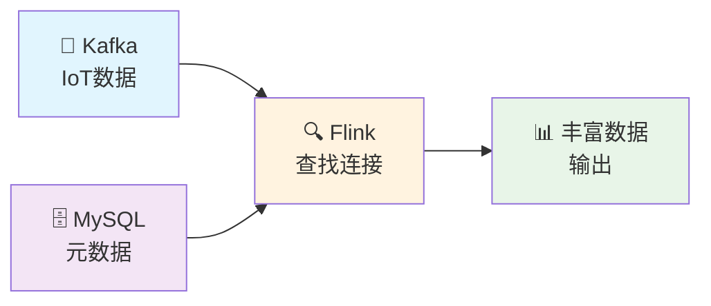
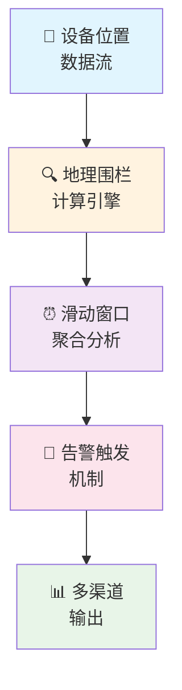

# 🚀 Apache Flink 实战系列

**基于PyFlink的企业级实时流处理解决方案**

*从理论到实践，深度解析Flink核心技术与应用场景*

---

## 📚 系列概览

本系列基于真实的生产环境项目，深入探讨Apache Flink在实时数据处理领域的核心应用。通过两个典型的业务场景，全面展示Flink的强大能力和最佳实践。

### 🎯 技术栈
- **流处理引擎**: Apache Flink (PyFlink)
- **消息队列**: Apache Kafka
- **数据存储**: MySQL、Elasticsearch
- **状态管理**: RocksDB
- **监控运维**: Prometheus、Grafana

---

## 📖 博客文章

### 🔍 实时数据关联篇

#### [Flink Kafka MySQL 查找连接实战：实时数据丰富的最佳实践](./Flink_Kafka_MySQL_查找连接实战/)

**📊 项目背景**  
在IoT场景中，设备上报的原始数据往往缺少必要的元数据信息。本文详细介绍如何使用PyFlink实现Kafka + MySQL的查找连接，实现设备数据的实时丰富。

**🎯 核心亮点**
- ⚡ **高性能查找连接**: 基于缓存优化的MySQL维度表查找
- 🔄 **端到端流程**: 从Kafka消费到数据丰富的完整链路
- 📈 **性能调优**: 缓存策略、并行度、检查点优化
- 🛡️ **容错设计**: EXACTLY_ONCE语义保证数据一致性

**💡 技术要点**

**🏆 适用场景**
- IoT设备数据实时丰富
- 用户行为数据增强
- 订单信息实时关联
- 实时数据仓库建设

### 🌍 地理围栏篇

#### [基于PyFlink的电子围栏实时告警系统设计与实现](./blog_geo_fence_system/)

**📊 项目背景**  
在智慧城市和物联网应用中，电子围栏技术被广泛用于设备监控和区域管理。本文展示如何构建一个高性能、低延迟的电子围栏实时告警系统。

**🎯 核心亮点**
- 🗺️ **精准地理计算**: 基于Haversine公式的高精度距离计算
- ⏰ **滑动窗口处理**: 30秒滑动窗口实现准实时监控
- 🚨 **智能告警机制**: 支持告警去重和冷却期设置
- 📊 **多维度监控**: Elasticsearch存储 + 实时日志输出

**💡 技术架构**

**🏆 适用场景**
- 车辆轨迹监控
- 人员区域管理
- 设备电子围栏
- 智慧园区安防

---

## 🛠️ 技术架构对比

<strong>🔍 查找连接模式</strong>
<ul>
<li>💾 维度表缓存优化</li>
<li>🔄 实时数据关联</li>
<li>⚡ 低延迟查询</li>
<li>📈 高吞吐处理</li>
</ul>

<strong>🌍 窗口计算模式</strong>
<ul>
<li>⏰ 滑动窗口聚合</li>
<li>🧮 复杂事件处理</li>
<li>💾 状态管理</li>
<li>🚨 实时告警触发</li>
</ul>

<strong>🎯 共同特性</strong>
<ul>
<li>🛡️ EXACTLY_ONCE语义</li>
<li>📊 完善监控体系</li>
<li>🔧 生产级优化</li>
<li>📚 详细文档说明</li>
</ul>

<strong>📈 性能指标</strong>
<ul>
<li>⚡ 毫秒级延迟</li>
<li>🚀 万级QPS处理</li>
<li>💾 TB级状态管理</li>
<li>🔄 7x24小时稳定运行</li>
</ul>

---

## 🎓 学习路径

### 📖 阅读建议

1. **🔰 入门阶段**
   - 先阅读「查找连接实战」，理解Flink基础概念
   - 掌握Table API和DataStream API的使用

2. **🚀 进阶阶段**
   - 学习「电子围栏系统」，深入窗口计算和状态管理
   - 理解复杂事件处理和业务逻辑实现

3. **🏆 高级阶段**
   - 对比两种模式的适用场景
   - 掌握性能调优和生产部署

### 💡 实践建议

- **环境准备**: Docker Compose一键启动开发环境
- **代码实践**: 完整的可运行代码示例
- **监控调试**: 详细的调试和监控方案
- **生产部署**: 集群部署和运维最佳实践

---

## 🌟 技术价值

> **"从业务场景出发，用技术解决实际问题"**

### 🎯 业务价值
- **实时性**: 毫秒级数据处理响应
- **准确性**: EXACTLY_ONCE语义保证
- **可靠性**: 完善的容错和恢复机制
- **可扩展**: 支持水平扩展和弹性伸缩

### 🔧 技术价值
- **完整性**: 端到端的解决方案
- **实用性**: 基于真实生产环境
- **可复用**: 模块化设计，易于扩展
- **标准化**: 遵循最佳实践和规范

---

### 📬 技术交流

如果你对Flink实时计算有任何疑问或想法，欢迎与我交流讨论！

[📧 Email](mailto:286790238@qq.com) · [🐙 GitHub](https://github.com/michaelwang123)

*让我们一起探索实时计算的无限可能*

