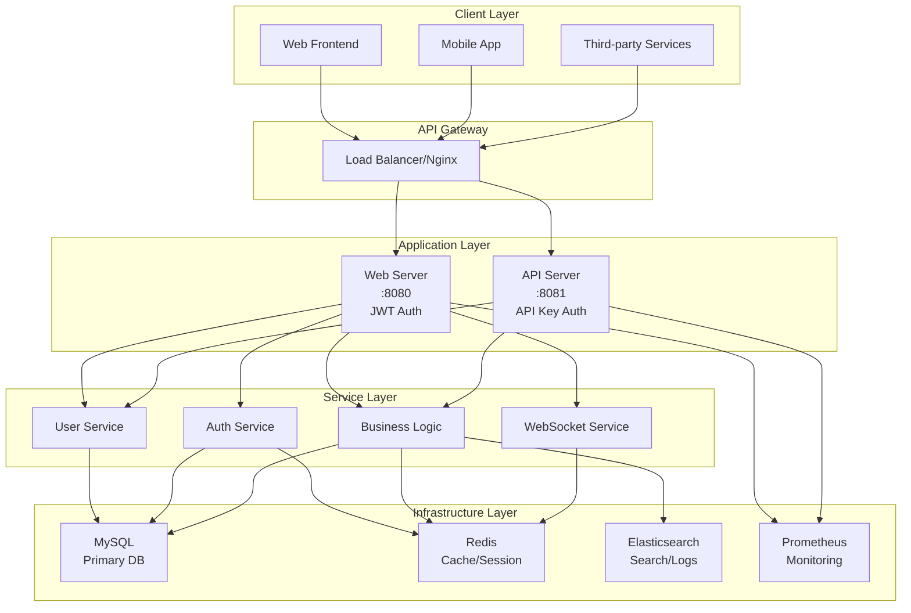
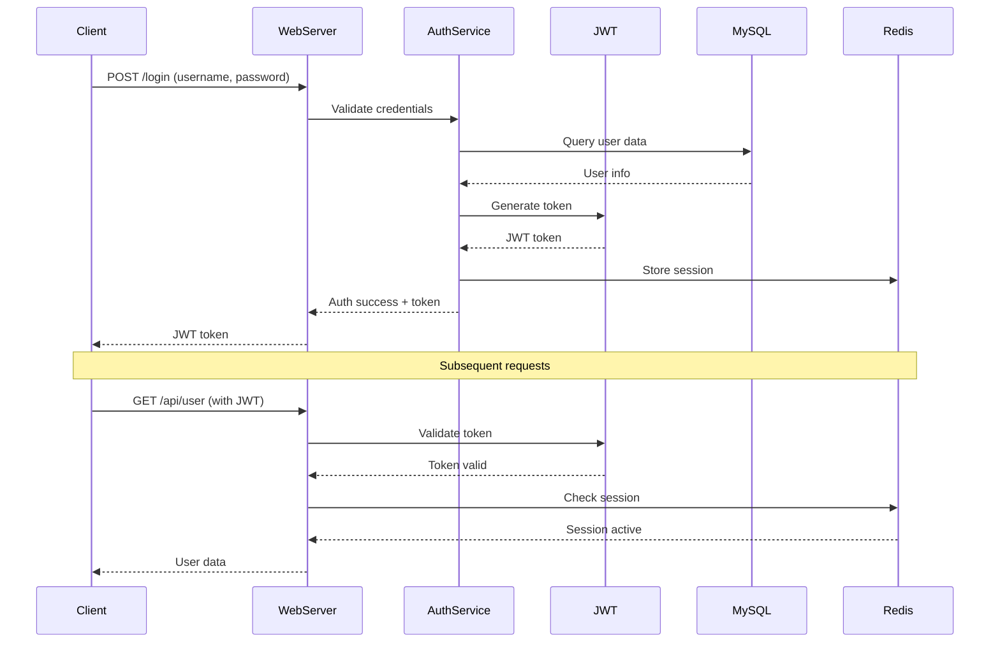
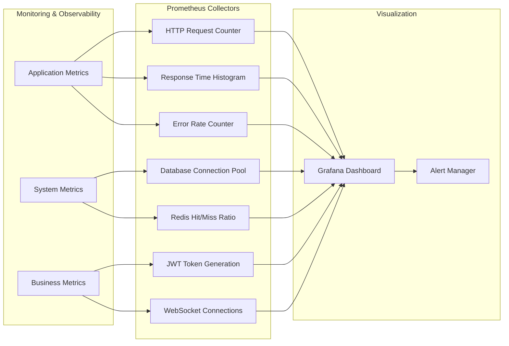

## 前言

在当今快速发展的技术环境中，构建一个可扩展、高性能且易于维护的后端服务架构变得越来越重要。本文将分享我们团队在构建 **Go Foundation** 项目过程中的技术选型、架构设计和实践经验。

Go Foundation 是一个基于 Go 语言的现代化微服务基础框架，它集成了当前主流的技术栈，为快速构建企业级应用提供了坚实的基础。

## 技术栈概览

### 核心技术选型

我们的技术栈基于以下核心组件：

**后端框架与语言**
- **Go 1.24.2**: 选择 Go 作为主要开发语言，得益于其出色的并发性能和简洁的语法
- **Gin Framework**: 高性能的 HTTP Web 框架，提供了丰富的中间件支持

**数据存储层**
- **MySQL + GORM**: 主数据库采用 MySQL，通过 GORM ORM 框架简化数据库操作
- **Redis**: 用于缓存、会话管理和实时数据存储
- **Elasticsearch**: 提供全文搜索和日志存储能力

**认证与安全**
- **JWT (JSON Web Token)**: 实现无状态的用户认证
- **API Key**: 服务间认证机制
- **Go Crypto**: 提供加密相关功能

**配置与监控**
- **Viper**: 灵活的配置管理解决方案
- **Zap**: 高性能结构化日志库
- **Prometheus**: 系统监控和指标收集

**实时通信**
- **WebSocket**: 支持实时双向通信功能

## 系统架构设计

### 整体架构

我们采用了分层架构设计，将系统划分为以下几个层次：

1. **客户端层**: 包括 Web 前端、移动应用和第三方服务
2. **网关层**: 负载均衡和请求路由
3. **应用层**: 双服务架构（Web 服务器 + API 服务器）
4. **服务层**: 业务逻辑处理
5. **基础设施层**: 数据存储和监控



### 双服务架构

项目采用了独特的双服务架构设计：

**Web 服务器 (端口 8080)**
- 处理前端页面请求
- 实现 JWT 认证机制
- 支持 WebSocket 实时通信
- 面向用户的业务逻辑

**API 服务器 (端口 8081)**
- 处理服务间 API 交互
- 基于 API Key 的认证
- 支持多种协议：RESTful API、GraphQL、gRPC
- 集成 Elasticsearch 存储

这种设计的优势：
- **职责分离**: 清晰区分用户请求和服务间调用
- **安全隔离**: 不同的认证机制适用于不同的使用场景
- **性能优化**: 可以针对不同类型的请求进行专门优化

## 认证机制实现

### JWT 认证流程

我们实现了完整的 JWT 认证机制，包括 token 生成、验证和刷新：

```go
type JWT struct {
    secretKey []byte
}

type Claims struct {
    UserID   uint   `json:"user_id"`
    Username string `json:"username"`
    jwt.RegisteredClaims
}

func (j *JWT) GenerateToken(userID uint, username string) (string, error) {
    now := time.Now().UTC()
    claims := Claims{
        UserID:   userID,
        Username: username,
        RegisteredClaims: jwt.RegisteredClaims{
            ExpiresAt: &jwt.NumericDate{Time: now.Add(24 * time.Hour)},
            IssuedAt:  &jwt.NumericDate{Time: now},
            NotBefore: &jwt.NumericDate{Time: now},
        },
    }
    
    token := jwt.NewWithClaims(jwt.SigningMethodHS256, claims)
    return token.SignedString(j.secretKey)
}
```

### 安全特性

1. **时间戳验证**: 包含签发时间、生效时间和过期时间
2. **UTC 时间**: 避免时区问题
3. **强密钥**: 使用复杂的密钥进行签名
4. **会话管理**: 结合 Redis 实现会话控制

### JWT 认证时序图

下图展示了完整的JWT认证流程：



## 监控与可观测性

### Prometheus 集成

我们集成了 Prometheus 进行全方位的系统监控：

**应用级指标**
- HTTP 请求计数和响应时间
- 错误率统计
- JWT token 生成和验证指标

**系统级指标**
- 数据库连接池状态
- Redis 缓存命中率
- WebSocket 连接数

**业务级指标**
- 用户注册和活跃度
- 订单处理时间
- 自定义业务指标

### 监控实现示例

```go
var (
    httpRequestsTotal = prometheus.NewCounterVec(
        prometheus.CounterOpts{
            Name: "http_requests_total",
            Help: "Total number of HTTP requests",
        },
        []string{"method", "endpoint", "status"},
    )
    
    httpRequestDuration = prometheus.NewHistogramVec(
        prometheus.HistogramOpts{
            Name:    "http_request_duration_seconds",
            Help:    "HTTP request duration in seconds",
            Buckets: prometheus.DefBuckets,
        },
        []string{"method", "endpoint"},
    )
)
```

### 监控架构图

我们的监控系统采用分层设计，从指标收集到可视化展示：



## 配置管理策略

### 多环境配置

项目支持多环境配置管理：

- `config.yaml`: 基础配置
- `config.development.yaml`: 开发环境配置
- `config.production.yaml`: 生产环境配置

### 配置特性

1. **环境变量支持**: 通过 Godotenv 加载 `.env` 文件
2. **配置热更新**: Viper 支持配置文件监听
3. **类型安全**: 强类型配置结构体
4. **敏感信息保护**: JWT 密钥等敏感信息独立管理

## 项目结构最佳实践

我们遵循 Go 社区推荐的项目结构：

```
go-foundation/
├── cmd/                    # 应用入口点
│   ├── api/               # API 服务入口
│   └── server/            # Web 服务入口
├── internal/              # 私有应用代码
│   ├── api/               # API 处理层
│   ├── handler/           # HTTP 处理器
│   ├── service/           # 业务逻辑层
│   ├── repository/        # 数据访问层
│   └── model/             # 数据模型
├── pkg/                   # 公共库代码
│   ├── jwt/               # JWT 工具
│   ├── logger/            # 日志工具
│   └── utils/             # 通用工具
├── api/                   # API 定义
│   ├── openapi/           # OpenAPI 规范
│   ├── graphql/           # GraphQL Schema
│   └── proto/             # Protocol Buffers
├── config/                # 配置文件
└── deployments/           # 部署配置
```

## 性能优化实践

### 数据库优化

1. **连接池管理**: 通过 GORM 配置合理的连接池大小
2. **查询优化**: 使用索引和查询优化技巧
3. **读写分离**: 支持主从数据库配置

### 缓存策略

1. **Redis 缓存**: 热点数据缓存
2. **会话存储**: JWT token 黑名单管理
3. **缓存穿透保护**: 防止缓存击穿

### 并发处理

1. **Goroutine 池**: 控制并发数量
2. **Channel 通信**: 安全的并发数据传递
3. **Context 超时**: 请求超时控制

## 部署与运维

### 容器化部署

项目支持 Docker 容器化部署：

```dockerfile
FROM golang:1.24-alpine AS builder
WORKDIR /app
COPY . .
RUN go mod tidy && go build -o main cmd/server/main.go

FROM alpine:latest
RUN apk --no-cache add ca-certificates
WORKDIR /root/
COPY --from=builder /app/main .
COPY --from=builder /app/config ./config
CMD ["./main"]
```

### 监控告警

1. **Prometheus + Grafana**: 可视化监控面板
2. **AlertManager**: 自动告警机制
3. **日志聚合**: 集中式日志管理

## 扩展性设计

### 微服务架构

项目设计支持向微服务架构演进：

1. **服务拆分**: 按业务域拆分服务
2. **API 网关**: 统一入口管理
3. **服务发现**: 支持服务注册与发现
4. **分布式追踪**: 请求链路追踪

### 多协议支持

- **RESTful API**: 标准 HTTP API
- **GraphQL**: 灵活的查询语言
- **gRPC**: 高性能 RPC 调用
- **WebSocket**: 实时通信协议

## 总结与展望

Go Foundation 项目展示了如何使用现代化的技术栈构建一个可扩展、高性能的后端服务架构。通过合理的技术选型、清晰的架构设计和完善的监控体系，我们构建了一个适合企业级应用的基础框架。

### 项目亮点

1. **双服务架构**: 创新的架构设计，职责分离明确
2. **完整的认证体系**: JWT + API Key 双重认证机制
3. **全面的监控**: Prometheus 集成，可观测性强
4. **多协议支持**: 适应不同的业务场景需求
5. **标准项目结构**: 遵循 Go 社区最佳实践

### 未来规划

1. **服务网格**: 引入 Istio 或 Linkerd
2. **云原生**: Kubernetes 部署支持
3. **AI 集成**: 机器学习模型服务化
4. **边缘计算**: 支持边缘节点部署

通过这个项目的实践，我们深刻体会到选择合适的技术栈和架构设计对项目成功的重要性。希望这些经验能够对正在构建类似项目的开发者有所帮助。

---

*本文基于 Go Foundation 项目的实际开发经验总结，项目代码已开源，欢迎交流讨论。* 