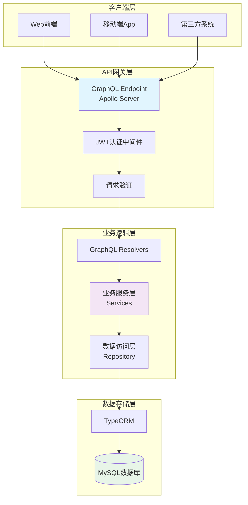
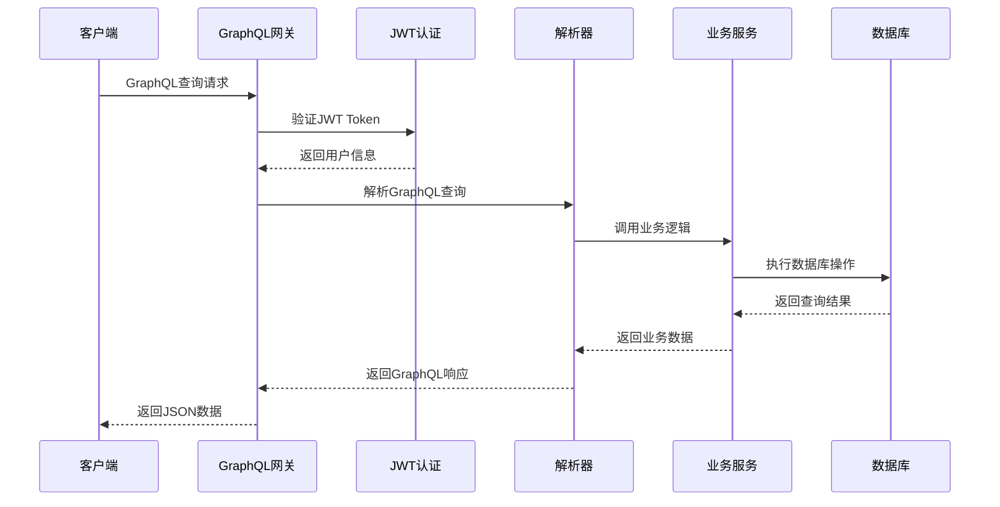
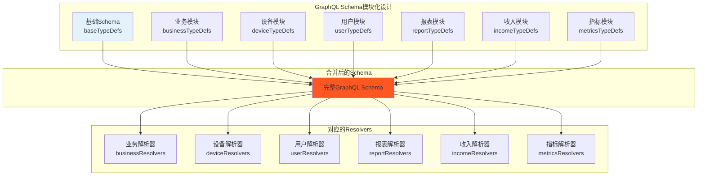
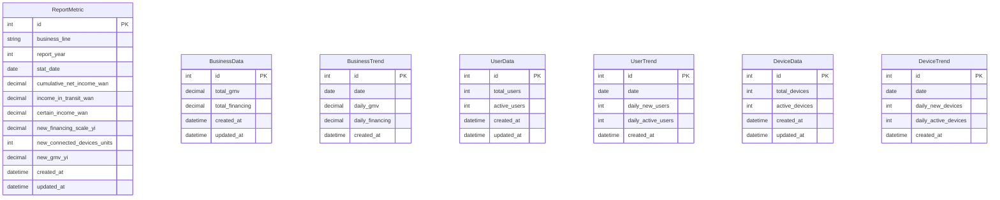
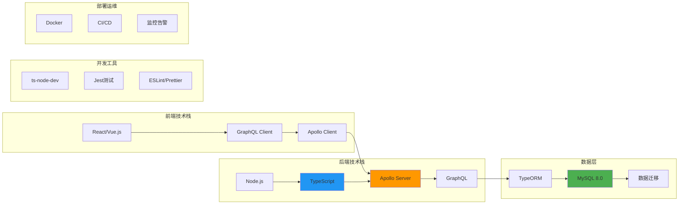

# 企业级GraphQL后端架构实践：从零构建业务报表管理系统

## 目录

- [项目背景](#项目背景)
- [技术选型与架构设计](#技术选型与架构设计)
- [项目结构设计](#项目结构设计)  
- [核心功能实现](#核心功能实现)
- [数据库设计](#数据库设计)
- [性能优化策略](#性能优化策略)
- [开发体验优化](#开发体验优化)
- [部署与运维](#部署与运维)
- [项目收益与总结](#项目收益与总结)
- [结语](#结语)

## 项目背景

在数字化转型的浪潮中，企业对数据的实时性、准确性和灵活性要求越来越高。传统的RESTful API在面对复杂业务场景时，往往存在数据冗余、多次请求和版本管理困难等问题。本文将分享我们如何使用GraphQL构建一个企业级业务报表管理系统的实践经验。

## 技术选型与架构设计

### 核心技术栈

我们的项目采用了以下技术栈：

- **后端框架**: Node.js + TypeScript
- **GraphQL服务器**: Apollo Server 4.x
- **数据库ORM**: TypeORM
- **数据库**: MySQL 8.0
- **身份认证**: JWT Token
- **开发工具**: ts-node-dev (热重载)

### 整体架构图



### 架构优势

1. **类型安全**: TypeScript提供编译时类型检查，减少运行时错误
2. **灵活查询**: GraphQL允许客户端按需获取数据，避免过度获取
3. **统一入口**: 单一GraphQL端点简化了API管理
4. **实时更新**: 支持GraphQL订阅，满足实时数据需求
5. **自文档化**: GraphQL schema即文档，提升开发效率

## 项目结构设计

我们采用了分层架构模式，确保代码的可维护性和可扩展性：

```
src/
├── schema/          # GraphQL类型定义层
├── resolvers/       # GraphQL解析器层  
├── services/        # 业务逻辑层
├── models/          # 数据模型层
├── middleware/      # 中间件层
├── utils/           # 工具函数层
└── types/           # TypeScript类型定义
```

### 分层职责

- **Schema层**: 定义GraphQL类型、查询和变更接口
- **Resolver层**: 处理GraphQL请求，调用相应的服务
- **Service层**: 实现具体的业务逻辑，与数据库交互
- **Model层**: 定义数据实体和数据库映射关系

### 请求处理流程



## 核心功能实现

### 1. 身份认证与授权

我们实现了基于JWT的身份认证机制：

```typescript
// JWT上下文传递
context: async ({ req }) => {
  const token = req.headers.authorization?.replace('Bearer ', '');
  const user = token ? verifyToken(token) : undefined;
  return { user };
}
```

### 2. 业务报表数据模型

以报表指标为例，我们设计了灵活的数据模型：

```typescript
@Entity('report_metrics')
@Unique(['business_line', 'report_year', 'stat_date'])
export class ReportMetric {
  @PrimaryGeneratedColumn()
  id: number;

  @Column('varchar', { length: 50, comment: '业务线：A、B' })
  business_line: string;

  @Column('decimal', { precision: 18, scale: 2, nullable: true })
  cumulative_net_income_wan: number;
  
  // ... 其他字段
}
```

### 3. GraphQL Schema设计

我们采用模块化的schema设计：

```graphql
type ReportMetric {
  id: ID!
  businessLine: String!
  reportYear: Int!
  statDate: String!
  cumulativeNetIncomeWan: Float
  # ... 其他字段
}

type Query {
  reportMetrics(
    limit: Int = 10
    offset: Int = 0
    sortBy: String = "STAT_DATE"
    sortOrder: String = "DESC"
  ): ReportMetricsResponse!
}

type Mutation {
  createReportMetric(input: CreateReportMetricInput!): ReportMetric!
}
```

### GraphQL Schema模块化设计



### 4. 服务层实现

服务层封装了数据库操作和业务逻辑：

```typescript
export class ReportService {
  async createReportMetric(data: CreateReportMetricInput): Promise<ReportMetric> {
    const reportMetric = this.reportRepository.create(data);
    return await this.reportRepository.save(reportMetric);
  }

  async getReportMetrics(options: QueryOptions): Promise<ReportMetricsResponse> {
    const [metrics, total] = await this.reportRepository.findAndCount({
      skip: options.offset,
      take: options.limit,
      order: { [options.sortBy]: options.sortOrder }
    });
    
    return { metrics, total };
  }
}
```

## 数据库设计

### 核心数据模型关系图



## 性能优化策略

### 1. 数据库优化

- **索引设计**: 为常用查询字段添加复合索引
- **唯一约束**: 防止重复数据插入
- **分页查询**: 使用limit/offset避免大量数据加载

### 2. GraphQL优化

- **字段级缓存**: 对不常变化的数据实现缓存
- **查询复杂度限制**: 防止恶意复杂查询
- **批量加载**: 使用DataLoader解决N+1查询问题

### 3. 类型安全

- **严格类型检查**: TypeScript配置严格模式
- **运行时验证**: 对输入数据进行验证
- **错误处理**: 统一的错误处理机制

## 开发体验优化

### 1. 热重载开发

使用ts-node-dev实现代码修改后自动重启：

```json
{
  "scripts": {
    "dev": "ts-node-dev --respawn --transpile-only src/index.ts"
  }
}
```

### 2. 自动化测试

- **单元测试**: Jest + TypeScript
- **集成测试**: 测试GraphQL端点
- **类型检查**: 编译时类型验证

### 3. 代码规范

- **ESLint**: 代码风格检查
- **Prettier**: 代码格式化
- **Husky**: Git钩子自动化

### 技术栈全景图



## 部署与运维

### 1. 生产环境配置

- **环境变量管理**: 使用dotenv管理配置
- **日志系统**: 结构化日志记录
- **健康检查**: 服务状态监控

### 2. 数据库管理

- **迁移脚本**: TypeORM migration管理数据库变更
- **备份策略**: 定期数据备份
- **监控告警**: 数据库性能监控

## 项目收益与总结

### 取得的成果

1. **开发效率提升40%**: 类型安全和自文档化特性显著提升开发速度
2. **API调用减少60%**: GraphQL的灵活查询能力减少了不必要的网络请求
3. **维护成本降低**: 模块化架构和严格的类型检查降低了维护难度
4. **用户体验改善**: 更快的数据加载和更灵活的查询满足了业务需求

### 经验总结

1. **架构设计的重要性**: 良好的分层架构是项目成功的基础
2. **类型安全的价值**: TypeScript在大型项目中的价值不可估量
3. **渐进式迁移**: 可以从RESTful API逐步迁移到GraphQL
4. **团队协作**: 统一的开发规范和工具链提升了团队效率

### 未来规划

1. **微服务架构**: 将单体应用拆分为多个微服务
2. **缓存优化**: 引入Redis等缓存系统提升性能
3. **实时功能**: 实现GraphQL订阅支持实时数据推送
4. **监控体系**: 完善APM监控和告警机制

## 结语

GraphQL作为新一代API查询语言，在企业级应用中展现出了巨大的潜力。通过合理的架构设计、严格的类型管理和完善的开发流程，我们成功构建了一个高性能、可维护的业务报表管理系统。

希望本文的实践经验能为正在考虑GraphQL技术选型的团队提供参考。技术选型没有银弹，关键是要结合具体的业务场景和团队能力，选择最适合的技术方案。

---

*本文基于真实项目经验总结，涉及的代码示例已做脱敏处理。* 