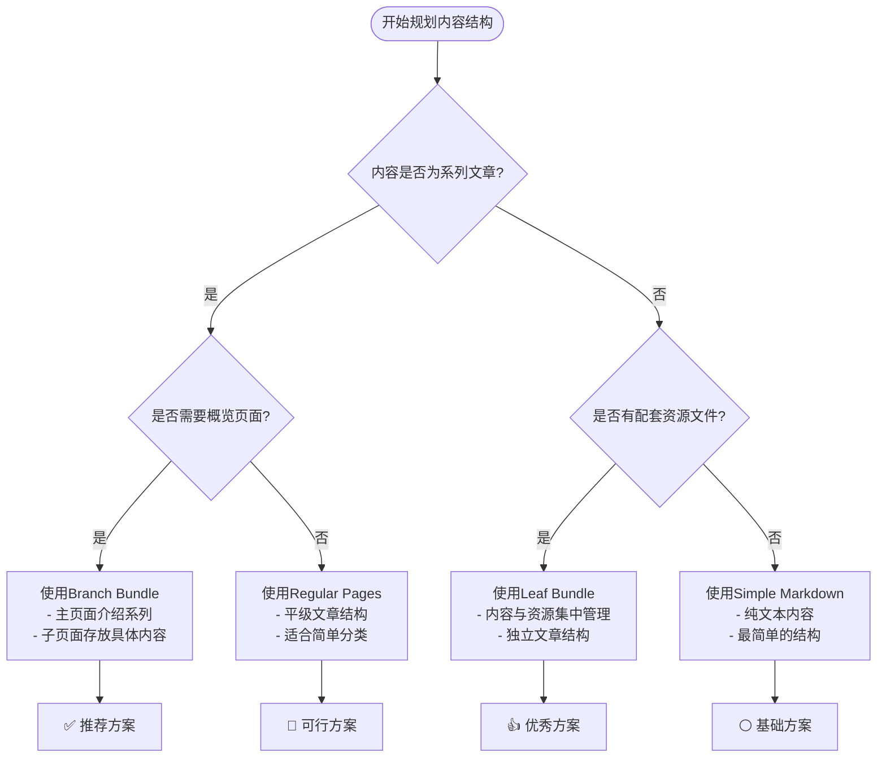

## 前言

在使用Hugo构建静态网站时，内容组织结构是一个关键决策。选择合适的组织方式不仅影响URL结构，还会影响SEO效果、维护效率和用户体验。本文将深入解析Hugo的三种内容组织方式，并提供实用的最佳实践建议。

## Hugo内容组织的三种方式

### 1. Leaf Bundle（叶子束）

Leaf Bundle是Hugo中最简单的内容组织方式，适用于独立的文章或页面。

**结构特征：**
```
content/posts/my-article/
├── index.md          # 主内容文件
├── featured.jpg      # 特色图片
├── diagram.png       # 文章配图
└── data.json         # 相关数据文件
```

**特点：**
- 每个目录只能包含一个`index.md`文件
- 可以包含相关的资源文件（图片、视频、数据等）
- 不能有子页面
- URL结构：`/posts/my-article/`

### 2. Branch Bundle（分支束）

Branch Bundle允许你创建有层次结构的内容集合，适用于系列文章或文档。

**结构特征：**
```
content/posts/hugo-guide/
├── index.md                    # 主页面（概览）
├── installation/
│   └── index.md               # 子页面：安装指南
├── configuration/
│   └── index.md               # 子页面：配置说明
└── deployment/
    └── index.md               # 子页面：部署方法
```

**特点：**
- 主目录包含`index.md`作为概览页面
- 子目录作为Leaf Bundle组织
- 清晰的层次结构
- URL结构：`/posts/hugo-guide/installation/`

### 3. Regular Pages（常规页面）

传统的平级文件组织方式，每个markdown文件对应一个页面。

**结构特征：**
```
content/posts/tutorials/
├── hugo-basics.md
├── hugo-themes.md
└── hugo-deployment.md
```

**特点：**
- 每个`.md`文件是独立页面
- 没有资源文件的集中管理
- URL结构：`/posts/tutorials/hugo-basics/`

## 三种方式的对比分析

让我用图表来直观展示这三种方式的区别：


graph TB
    subgraph "Leaf Bundle"
        A[content/posts/] --> B[my-article/]
        B --> C[index.md]
        B --> D[images/]
        B --> E[data.json]
    end
    
    subgraph "Branch Bundle"
        F[content/posts/] --> G[hugo-guide/]
        G --> H[index.md 主页]
        G --> I[installation/]
        G --> J[config/]
        I --> K[index.md]
        J --> L[index.md]
    end
    
    subgraph "Regular Pages"
        M[content/posts/] --> N[tutorials/]
        N --> O[hugo-basics.md]
        N --> P[hugo-themes.md]
        N --> Q[hugo-deployment.md]
    end


## 推荐使用方案

### 🏆 **首选：Branch Bundle + Leaf Bundle 混合模式**

我强烈推荐使用**Branch Bundle + Leaf Bundle的混合模式**，原因如下：

#### 1. **灵活性最高**
- 可以根据内容性质选择合适的组织方式
- 支持复杂的内容层次结构
- 易于扩展和重构

#### 2. **资源管理优势**
- 每个内容单元的资源文件集中管理
- 图片、数据文件与内容文件在同一目录
- 避免资源文件散落各处

#### 3. **SEO和用户体验**
- 清晰的URL层次结构
- 每个页面可以独立优化元数据
- 支持面包屑导航

### 实际应用建议


flowchart TD
    A{内容类型判断} --> B{是否有子页面?}
    B -->|是| C[使用Branch Bundle]
    B -->|否| D{是否有相关资源?}
    D -->|是| E[使用Leaf Bundle]
    D -->|否| F[使用Regular Page]
    
    C --> G[主页面: index.md<br/>子页面: subdirs/index.md]
    E --> H[单目录: index.md + 资源文件]
    F --> I[单文件: article.md]


## 关键规则详解

### 🔑 **Hugo Bundle系统核心规则**

Hugo的Bundle系统有一个**关键规则**，这是很多人容易忽视但极其重要的：

#### **🚨 最重要的规则：文件名决定Bundle类型**

```bash
# ✅ Branch Bundle (分支束) - 可以有子页面
content/posts/skill-learning/
├── _index.md           # 注意：下划线开头！
├── golang/
│   └── index.md        # 子页面
└── docker/
    └── index.md        # 子页面

# ❌ Leaf Bundle (叶子束) - 不能有子页面
content/posts/skill-learning/
├── index.md            # 注意：没有下划线！
├── golang/             # 这些子目录会被忽略！
│   └── index.md        # Hugo不会识别这个页面！
└── docker/
    └── index.md        # Hugo不会识别这个页面！
```

#### **⚡ 核心区别对照表**

| 文件名 | Bundle类型 | 子页面支持 | 适用场景 |
|--------|------------|------------|----------|
| **`_index.md`** | Branch Bundle | ✅ **可以有子页面** | 分类首页、知识体系主页 |
| **`index.md`** | Leaf Bundle | ❌ **不能有子页面** | 独立文章、项目介绍 |

#### **🐛 常见错误案例**

这是一个真实的bug案例，可能会让你的页面返回404：

```bash
# ❌ 错误配置：导致子页面404
content/posts/skill-learning/
├── index.md                    # 错误：应该是_index.md
├── golang/
│   ├── index.md               # 错误：应该是_index.md  
│   └── go-project/
│       └── index.md           # 404! Hugo无法识别
└── flink-python/
    ├── index.md               # 错误：应该是_index.md
    └── py-project/
        └── index.md           # 404! Hugo无法识别
```

```bash
# ✅ 正确配置：所有页面都能正常访问
content/posts/skill-learning/
├── _index.md                   # 正确：Branch Bundle
├── golang/
│   ├── _index.md              # 正确：Branch Bundle
│   └── go-project/
│       └── index.md           # ✅ 正常访问
└── flink-python/
    ├── _index.md              # 正确：Branch Bundle  
    └── py-project/
        └── index.md           # ✅ 正常访问
```

#### **🔍 Bundle识别规则详解**

1. **文件名规则**
   - `_index.md` → Branch Bundle（分支束）
   - `index.md` → Leaf Bundle（叶子束）

2. **Hugo构建行为**
   - Branch Bundle：Hugo会扫描所有子目录寻找页面
   - Leaf Bundle：Hugo**忽略**所有子目录的内容

3. **页面生成规则**
   - Branch Bundle：生成主页面 + 所有子页面
   - Leaf Bundle：**只**生成当前目录的页面

#### **💡 最佳实践决策流程**


flowchart TD
    Start([创建新目录]) --> Question{这个目录下会有子页面吗?}
    
    Question -->|是| Branch[使用 _index.md<br/>🎯 Branch Bundle]
    Question -->|否| Leaf[使用 index.md<br/>📄 Leaf Bundle]
    
    Branch --> BranchExample[例如：技能分类主页<br/>content/posts/skill-learning/_index.md]
    Leaf --> LeafExample[例如：具体项目介绍<br/>content/posts/my-project/index.md]
    
    BranchExample --> Success[✅ 子页面能正常访问]
    LeafExample --> Success


### 🛠️ **其他重要规则**

1. **唯一性规则**
   - 每个目录最多只能有一个`index.md`或`_index.md`文件
   - 不能同时存在`index.md`和`_index.md`

2. **资源文件规则**
   - Bundle内的非markdown文件被视为Page Resources
   - 可以在模板中通过`.Resources`访问
   - 支持图片处理、文件压缩等功能

3. **URL生成规则**
   - Branch Bundle主页：`/section/`
   - Branch Bundle子页：`/section/subsection/`
   - Leaf Bundle：`/section/article/`

### ⚠️ **常见陷阱**

```markdown
❌ 错误示例：
content/posts/my-series/
├── index.md        # Branch Bundle主页
├── chapter1.md     # 这个文件会被忽略！
└── chapter2.md     # 这个文件也会被忽略！

✅ 正确示例：
content/posts/my-series/
├── index.md        # Branch Bundle主页
├── chapter1/
│   └── index.md    # Leaf Bundle
└── chapter2/
    └── index.md    # Leaf Bundle
```

## 设计好处分析

### 📁 **资源管理优势**

**传统方式的问题：**
```
content/
├── posts/
│   ├── article1.md
│   └── article2.md
└── images/
    ├── article1-img1.jpg
    ├── article1-img2.jpg
    └── article2-img1.jpg
```

**Bundle方式的优势：**
```
content/posts/
├── article1/
│   ├── index.md
│   ├── featured.jpg
│   └── diagram.png
└── article2/
    ├── index.md
    └── screenshot.png
```

### 🔗 **URL结构优势**


graph LR
    A[Bundle结构] --> B[清晰的URL层次]
    B --> C[/posts/category/article/]
    B --> D[利于SEO优化]
    B --> E[用户友好]
    
    F[Regular Pages] --> G[平级URL结构]
    G --> H[/posts/article1/]
    G --> I[/posts/article2/]


### 🚀 **开发效率提升**

1. **内容迁移**：整个Bundle目录可以直接移动
2. **资源引用**：相对路径引用，不会因目录调整而失效
3. **模块化管理**：每个Bundle是一个独立的内容单元
4. **版本控制**：Git中每个Bundle的变更历史清晰

### 📱 **SEO和性能优势**

1. **独立元数据**：每个页面可以设置专属的SEO参数
2. **图片优化**：Hugo可以自动处理Bundle内的图片资源
3. **缓存策略**：静态资源与内容分离，便于CDN缓存

## 实战建议

### 🎯 **选择决策树**



### 📋 **迁移检查清单**

如果你正在重构现有的Hugo网站，可以按以下步骤进行：

- [ ] **评估现有内容结构**
- [ ] **识别需要合并的相关内容**
- [ ] **规划新的Bundle层次结构**
- [ ] **批量创建目录和移动文件**
- [ ] **更新内部链接引用**
- [ ] **测试所有页面访问正常**
- [ ] **检查sitemap和RSS生成**

## 总结

Hugo的内容组织方式虽然有三种选择，但**Branch Bundle + Leaf Bundle的混合模式**无疑是最佳实践。它不仅提供了强大的内容管理能力，还能确保网站的可维护性和扩展性。

记住这个黄金规则：**内容越复杂，越需要结构化的Bundle组织方式**。

选择合适的内容组织结构，让你的Hugo网站既优雅又高效！

## 🔧 实战故障排除

### 常见问题：页面404但本地正常

**症状**：
- 本地`hugo server`可以正常访问页面
- 部署到生产环境（GitHub Pages、Netlify等）后返回404
- `hugo list all`显示的页面数量少于预期

**诊断步骤**：

1. **检查Hugo页面识别**
   ```bash
   # 查看Hugo识别的页面数量
   hugo list all | wc -l
   
   # 查看具体的页面清单
   hugo list all
   ```

2. **检查sitemap生成**
   ```bash
   # 本地检查
   hugo && grep "你的页面路径" public/sitemap.xml
   
   # 线上检查
   curl -s https://yoursite.com/sitemap.xml | grep "你的页面路径"
   ```

3. **检查Bundle配置**
   ```bash
   # 查找所有使用index.md的目录（可能需要改为_index.md）
   find content -name "index.md" | grep -v "_index.md"
   
   # 检查目录结构
   tree content/
   ```

**解决方案**：

根据具体情况选择对应的修复方案：

#### 方案1：修复Branch Bundle配置

如果你的目录下**有子页面**，需要将`index.md`改为`_index.md`：

```bash
# 示例：修复skill-learning目录
mv content/posts/skill-learning/index.md content/posts/skill-learning/_index.md

# 批量修复多个目录
for dir in golang docker flink-python; do
    mv content/posts/skill-learning/$dir/index.md content/posts/skill-learning/$dir/_index.md
done
```

#### 方案2：验证修复效果

```bash
# 清理并重新构建
hugo --cleanDestinationDir

# 验证页面数量增加
hugo list all | wc -l

# 验证具体页面存在
hugo list all | grep "你的页面路径"

# 验证public目录结构
ls -la public/posts/skill-learning/
```

#### 方案3：检查构建日志

```bash
# 详细构建日志
hugo --verbose --debug

# 检查是否有警告
hugo --printPathWarnings
```

### 快速修复检查清单

- [ ] **确认Bundle类型**：有子页面的目录使用`_index.md`
- [ ] **检查front matter**：确保包含`draft: false`
- [ ] **验证目录结构**：确保没有孤立的markdown文件
- [ ] **测试本地构建**：`hugo list all`显示所有页面
- [ ] **检查sitemap**：确认页面被包含在sitemap中
- [ ] **验证URL访问**：使用curl或浏览器测试页面访问

### 预防措施

1. **建立规范**：团队统一使用Bundle规范
2. **自动化检查**：在CI/CD中添加页面数量检查
3. **定期审查**：定期检查`hugo list all`输出
4. **文档维护**：记录项目的Bundle使用规范

---

*希望这篇文章能帮助你更好地组织Hugo网站内容，避免常见的Bundle配置问题。如果你有任何问题或建议，欢迎在评论区交流讨论！* 🚀 