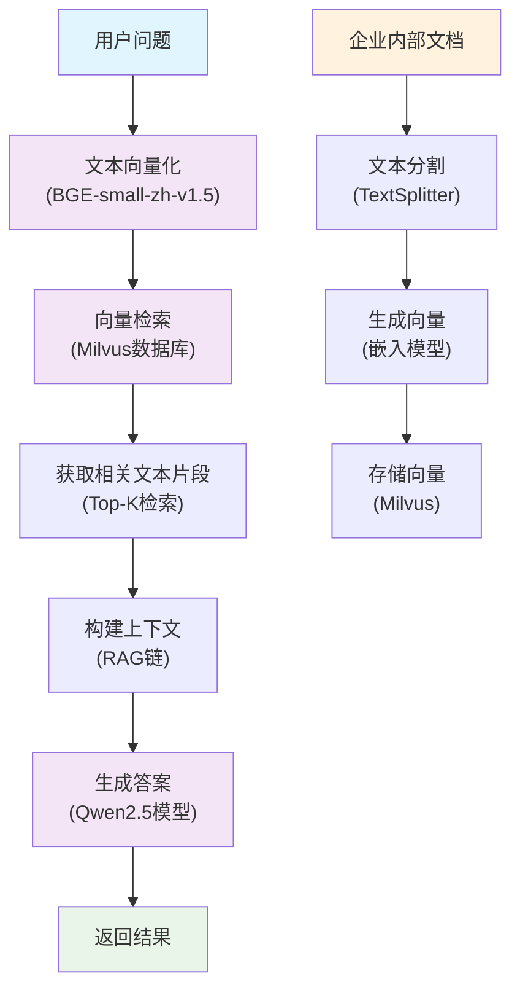
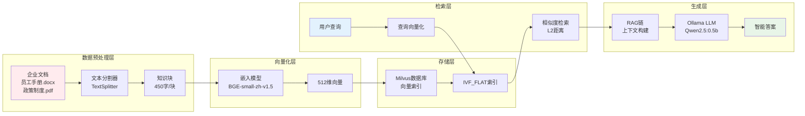
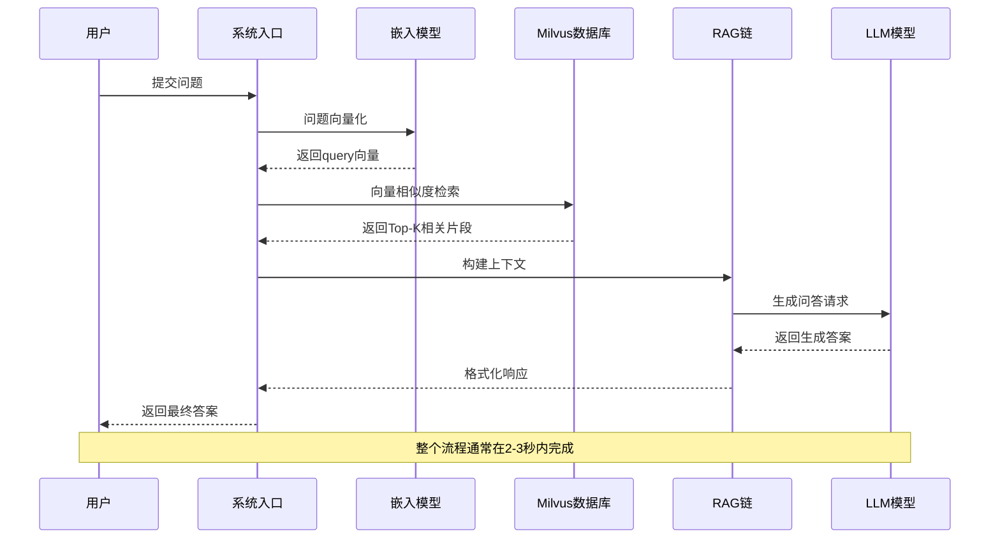
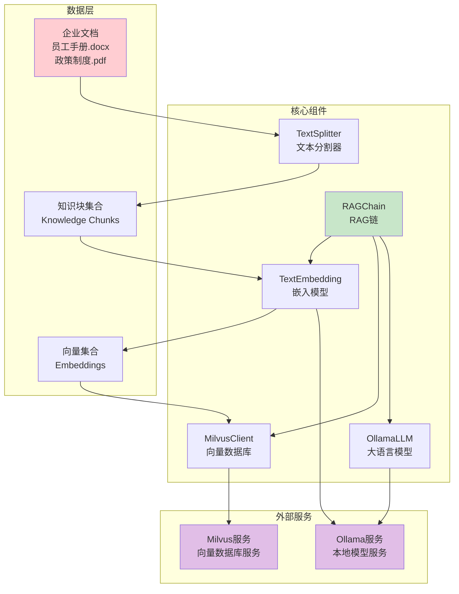

# 基于RAG的企业智能问答系统：让AI成为您的政策专家

## 前言

在企业数字化转型的浪潮中，如何让员工快速获取准确的内部政策信息、操作规范和业务知识，已成为提升工作效率的关键挑战。传统的文档检索方式往往效率低下，而直接询问大语言模型又无法获得企业特有的私有信息。检索增强生成（RAG，Retrieval-Augmented Generation）技术为这个问题提供了一个完美的解决方案。本文将详细介绍一个基于RAG架构的企业智能问答系统，该系统能够对公司内部政策文档进行智能问答。

## 项目概述

本项目是一个完整的企业级RAG（检索增强生成）系统，主要功能包括：

- **文档预处理**：将企业内部政策文档分割成合适的知识块
- **向量化存储**：使用中文优化的嵌入模型生成文档向量
- **向量数据库**：基于Milvus构建高效的知识检索系统
- **智能问答**：结合本地大语言模型实现基于企业知识的问答

该系统特别针对企业内部文档（如员工手册、政策制度、操作规范等）进行了优化，能够准确回答关于政策条款、流程步骤、规章制度等各种问题。

## 技术架构

### 系统架构图

以下是本系统的整体架构流程图：

**图1：RAG系统工作流程图**


**图2：系统分层架构图**


### 核心组件

1. **文本分割器（TextSplitter）**
   - 基于LangChain的RecursiveCharacterTextSplitter
   - 针对中文文本优化，支持按句号、感叹号等标点符号分割
   - 配置chunk_size=450，chunk_overlap=50确保上下文连贯性

2. **嵌入模型（TextEmbedding）**  
   - 使用BGE-small-zh-v1.5中文嵌入模型
   - 通过Ollama本地部署，确保数据隐私
   - 生成512维向量表示

3. **向量数据库（MilvusClient）**
   - 基于Milvus构建高性能向量检索系统
   - 使用IVF_FLAT索引算法，支持大规模向量检索
   - L2距离计算，确保检索精度

4. **大语言模型（OllamaLLM）**
   - 集成Qwen2.5:0.5b轻量级模型
   - 本地部署，保证响应速度和数据安全
   - 通过LangChain框架统一接口

5. **RAG链（RAGChain）**
   - 整合检索和生成流程
   - 设计专门的中文问答Prompt模板
   - 支持多轮对话和上下文理解

### 数据流程

系统的工作流程分为两个主要阶段：

**构建阶段：**
1. 读取企业内部文档（员工手册、政策制度、操作规范等）
2. 使用文本分割器将长文档切分成知识块
3. 为每个知识块生成向量表示
4. 将知识块和对应向量存储到Milvus数据库

**查询阶段：**
1. 接收员工问题（如"年假申请流程是什么？"）
2. 将问题转换为向量表示
3. 在向量数据库中检索最相关的知识块
4. 将检索结果作为上下文传递给大语言模型
5. 生成基于企业政策的准确答案并返回给用户

**图3：系统交互序列图**


**图4：系统组件关系图**


## 关键技术实现

### 1. 智能文本分割

```python
class TextSplitter:
    def __init__(self, chunk_size=450, chunk_overlap=50):
        self.splitter = RecursiveCharacterTextSplitter(
            separators=["\n\n", "\n", "。", "！", "？", "，", " ", ""],
            chunk_size=chunk_size,
            chunk_overlap=chunk_overlap
        )
```

这个实现的亮点在于：
- 针对中文企业文档特点，优先按段落和句子分割
- 合理的chunk_size确保每个知识块包含完整的政策条款或操作步骤
- chunk_overlap保证重要信息不会在分割边界丢失，确保政策解读的连贯性

### 2. 高效向量检索

```python
def search_similar_texts(self, collection_name, query_embedding, top_k=3):
    search_params = {
        "metric_type": "L2",
        "params": {"nprobe": 10}
    }
    
    results = collection.search(
        data=[query_embedding],
        anns_field="embedding",
        param=search_params,
        limit=top_k,
        output_fields=["text"]
    )
```

Milvus的优势：
- 支持十亿级别向量的毫秒级检索
- 灵活的索引策略适应不同场景需求
- 丰富的距离度量方式（L2、IP、COSINE等）

### 3. 智能问答生成

```python
def generate_answer(self, question: str, contexts: List[Dict]) -> str:
    context_texts = [f"相关片段 {i+1}：{ctx['text']}" for i, ctx in enumerate(contexts)]
    combined_context = "\n\n".join(context_texts)
    
    response = self.chain.run(
        question=question,
        context=combined_context
    )
    return response
```

RAG链的设计确保了：
- 检索到的多个相关政策条款能够有效整合
- 生成的答案严格基于企业文档内容，避免不准确的政策解读
- 支持复杂业务问题的多角度、多政策综合回答

## 系统特色与优势

### 1. 本地化部署
- 所有模型和数据都在本地运行，确保数据隐私和安全
- 无需依赖外部API，降低成本和延迟
- 可根据需要灵活调整模型参数

### 2. 企业级优化
- 选用专门为中文优化的BGE嵌入模型，适合企业中文文档
- 文档分割策略考虑企业文档结构特点（条款、流程、规范等）
- 问答模板针对企业政策查询场景设计

### 3. 可扩展性
- 模块化设计，易于扩展到其他领域
- 支持多种嵌入模型和语言模型
- 数据库和检索策略可灵活配置

### 4. 高性能
- Milvus提供毫秒级向量检索
- 轻量级语言模型确保快速响应
- 合理的缓存策略提升整体性能

## 实际应用效果

以企业政策问答为例，系统能够准确回答如下问题：

**问题**：我想申请年假，需要提前多久申请？有什么限制条件？

**系统流程**：
1. 将问题转换为向量
2. 检索到员工手册中相关的10个知识块
3. 结合这些政策条款生成答案

**答案示例**：根据公司员工手册第3.2节规定，年假申请需要提前5个工作日向直属上级提交申请。限制条件包括：（1）入职满一年后方可申请年假；（2）年假天数根据工作年限确定，1-5年为5天，6-10年为10天；（3）年假需在当年12月31日前使用完毕，不可跨年。

## 扩展应用场景

基于这个企业级RAG系统架构，可以扩展到多个业务场景：

1. **HR智能助手**：员工手册、薪酬政策、福利制度等HR相关问题的智能问答
2. **合规查询系统**：公司治理、法律法规、行业标准等合规问题的精准回答
3. **技术文档问答**：产品手册、API文档、操作指南等技术文档的智能检索
4. **客户服务升级**：基于产品说明书和FAQ构建更智能的客服系统
5. **培训辅助系统**：新员工培训、技能提升等培训材料的智能问答
6. **项目管理助手**：项目流程、管理制度、最佳实践等项目管理知识的查询

## 技术选型思考

### 为什么选择这些技术？

1. **LangChain**：提供了丰富的LLM应用开发工具链，简化了RAG系统的构建
2. **Milvus**：专业的向量数据库，在性能和功能上都优于传统数据库
3. **Ollama**：本地部署LLM的最佳选择，支持多种开源模型
4. **BGE模型**：中文嵌入任务的SOTA模型，效果显著优于通用模型

### 性能优化策略

1. **向量维度选择**：512维向量在精度和性能间取得良好平衡
2. **检索参数调优**：nprobe=10在速度和召回率间找到最优点
3. **模型选择**：Qwen2.5:0.5b模型在保证质量的同时确保快速响应

## 部署与维护

### 环境要求
- Python 3.8+
- Milvus 2.0+
- Ollama
- 至少8GB内存用于模型加载

### 部署步骤
1. 安装依赖：`pip install -r requirements.txt`
2. 启动Milvus服务
3. 下载并部署Ollama模型（BGE嵌入模型和Qwen2.5语言模型）
4. 准备企业文档数据（支持PDF、DOCX、TXT等格式）
5. 运行文档预处理脚本，构建知识库
6. 启动企业问答服务

### 监控与优化
- 定期监控向量数据库性能和查询响应时间
- 根据员工反馈调整检索参数和知识库内容
- 持续优化Prompt模板提升企业问答的准确性和专业性
- 建立问答质量评估机制，确保政策解读的准确性

## 未来发展方向

1. **多模态企业文档**：支持图表、流程图、音视频培训材料等多种媒体类型
2. **实时知识更新**：支持政策变更时的增量更新向量数据库
3. **个性化推荐**：基于员工角色和历史查询构建个性化知识推荐
4. **智能评估体系**：建立企业知识问答的质量评估和持续改进框架
5. **多语言支持**：支持中英文混合的跨国企业文档问答
6. **权限管控**：基于员工级别和部门实现细粒度的知识访问控制

## 结语

本项目展示了如何构建一个完整的企业级RAG系统，从文档预处理到智能问答的全流程实现。通过合理的技术选型和架构设计，我们实现了一个高效、准确、安全的企业知识问答系统。这个系统不仅能有效解决企业内部知识检索难题，更为企业数字化转型提供了强有力的技术支撑。

与依赖外部API的解决方案相比，本系统最大的优势在于**数据完全本地化**，确保企业敏感信息不会泄露。同时，针对企业特有的私有知识（政策制度、操作规范、业务流程等），RAG系统能够提供比通用大模型更准确、更专业的答案。

随着企业对知识管理需求的不断提升，RAG系统将成为企业智能化办公的重要基础设施。通过持续的技术迭代和优化，RAG系统将更好地服务于企业的知识管理和决策支持需求。

---

*如有技术问题，欢迎交流讨论。* 